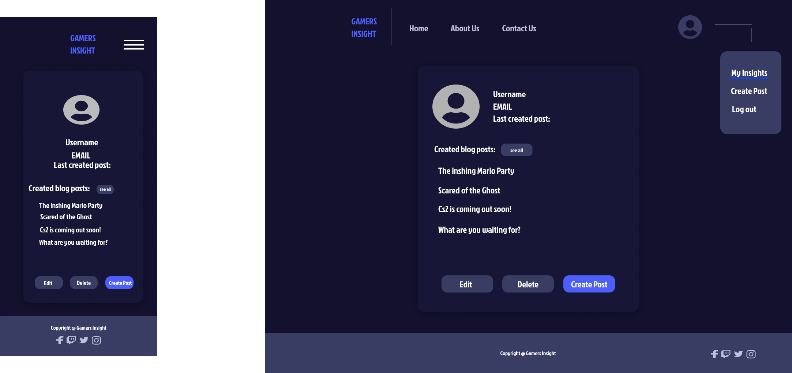
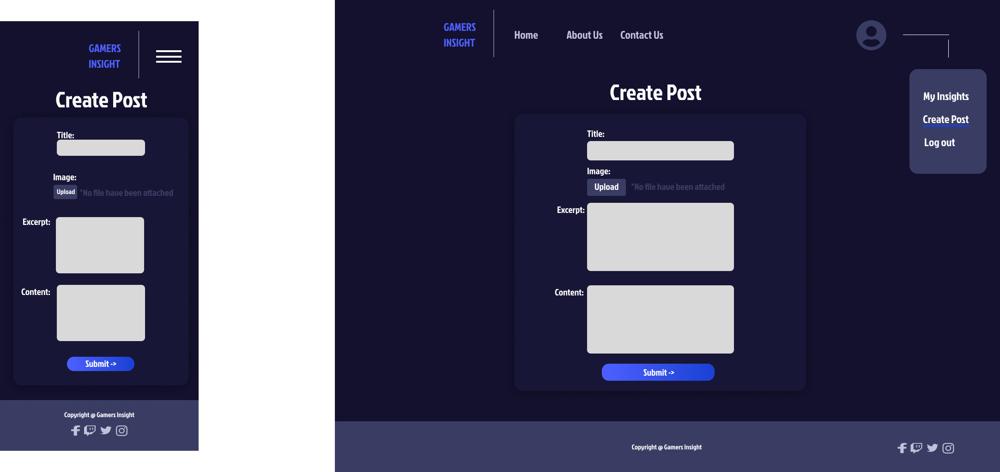
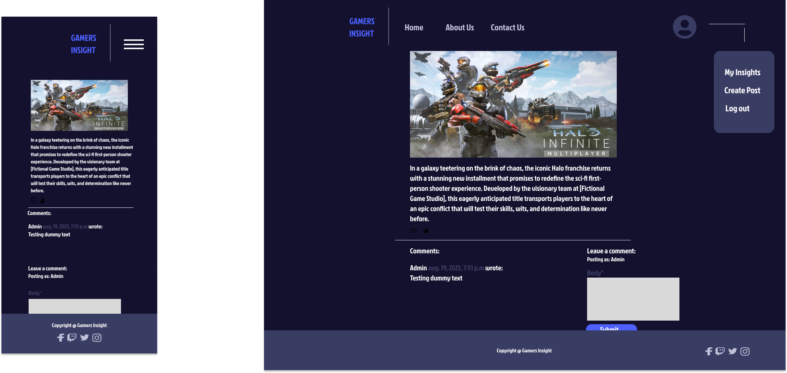

# Gamers Insight

Gamers Insight is a dynamic web application tailored for gaming enthusiasts, providing a platform to share and explore in-depth reviews of various video games. With Gamers Insight, users can create detailed blog posts to analyze game mechanics, graphics, storylines, and overall experiences. The application offers a seamless interface for readers to discover and engage with diverse gaming perspectives, while also fostering a community that appreciates thoughtful game critiques. Whether you're a passionate gamer or simply curious about the latest releases, Gamers Insight offers a space to immerse yourself in comprehensive game reviews and discussions.

<center> 

 

</center>


Developer: Kim Bergström <br>
[Live webpage]()


## Table of Content

1. [Project Goals](#project-goals)
    1. [User Goals](#user-goals)
    2. [Site Owner Goals](#site-owner-goals)
2. [User Experience](#user-experience)
    1. [Target Audience](#target-audience)
    2. [User Requirements and Expectations](#user-requirements-and-expectations)
    3. [User Stories](#user-stories)
3. [Database](#database)
    1. [User App](#user-app)
    2. [Gamers Blog App](#Gamersblog-app)
4. [Design](#design)
    1. [Design Choices](#design-choices)
    2. [Colour](#colours)
    3. [Fonts](#fonts)
    4. [Structure](#structure)
    5. [Wireframes](#wireframes)
5. [Technologies Used](#technologies-used)
    1. [Languages](#languages)
    2. [Frameworks](#frameworks)
    3. [Database](#database)
    4. [Tools](#tools)
    5. [Supporting Libraries and Packages](#supporting-libraries-and-packages)
6. [Methodology](#methodology)
    1. [Agile Project Management with GitHub Projects](#agile-project-management-with-github-projects)
    2. [User Stories as GitHub Issues](#user-stories-as-github-issues)
    3. [Bug Tracking](#bug-tracking)
    4. [Iterative Development Approach](#iterative-development-approach)
    5. [Backlog and Subsequent Iterations](#backlog-and-subsequent-iterations)
7. [Features](#features)
    1. [Landing Page](#landing-page)
    2. [Gamers Blog Pages](#gamersblog-pages)
    3. [Review Pages](#review-pages)
    4. [User Account Management](#user-account-management)
    5. [Blog Management](#Blog-management)
    6. [Navigation](#navigation)
    7. [Future Features](#future-features)
8. [Testing](#testing)
9. [Bugs](#bugs)
    1. [Known bugs](#known-bugs)
    2. [Fixed bugs](#fixed-bugs)
10. [Deployment](#deployment)
11. [Credits](#credits)
12. [Acknowledgements](#acknowledgements)

## Project Goals

Gamers Insight is a Django web application aimed at creating a vibrant platform for gamers to share their insights, opinions, and experiences about various games. The key objectives of the project include:

- **Empowering Gamers:** Providing a dedicated space for gamers to contribute their reviews, articles, and discussions about different games.
- **User-Centric Experience:** Offering users an engaging and intuitive interface that encourages exploration and interaction.
- **Content Organization:** Enabling users to categorize and manage their articles, reviews, and discussions effectively.
- **User Profiles:** Allowing users to create personalized profiles, showcase their gaming preferences, and keep track of their contributions.
- **Interactive Engagement:** Facilitating user interactions through comments, reviews, and discussions to foster a sense of community.
- **Administrator Control:** Equipping administrators with the tools to manage user accounts, moderate content, and ensure a safe environment.
- **Analytics and Insights:** Implementing analytics to understand user engagement, popular content, and areas for improvement.

### User Goals
- Exploring and sharing detailed game reviews and articles.
- Personalizing their profiles to showcase their gaming interests.
- Engaging in discussions and leaving comments to contribute to the gaming community.
- Saving favorite articles and reviews for easy access.
- Submitting their own game reviews, articles, and insights.
- Receiving notifications about new content and discussions.

### Site Owner Goals
- Providing a platform for gamers to express their thoughts and insights.
- Curating a diverse range of gaming-related content to cater to different preferences.
- Fostering a thriving gaming community where users can connect and share experiences.
- Ensuring user-generated content is moderated for quality and appropriateness.
- Enhancing user engagement and interaction through intuitive design and features.

Your project "Gamers Insight" aims to create a dynamic hub for gamers to connect, share, and explore the world of gaming through insightful articles, discussions, and reviews.

<p align="right">(<a href="#table-of-content">back to top</a>)</p>

## User Experience

### Target Audience
Gamers Insight is designed for the following target audience:

- Gaming enthusiasts and gamers looking for insights and reviews about various games.
- Individuals interested in exploring diverse gaming experiences and genres.
- Users who want to share their own game reviews, opinions, and experiences.
- Players seeking a platform to engage in discussions about their favorite games.
- Individuals who wish to stay updated with the latest gaming trends and discussions.

By catering to the interests and needs of gamers, Gamers Insight aims to become a hub for gaming enthusiasts to connect, share, and explore the gaming world.

### User Requirements and Expectations
When using Gamers Insight, users can expect the following features and characteristics to fulfill their needs:

- A user-friendly interface that provides intuitive navigation and easy access to gaming content.
- High-quality game reviews and articles that offer detailed insights and opinions.
- Responsive design ensuring a visually appealing experience across different devices.
- Personalized features, such as user profiles to showcase gaming preferences and track contributions.
- Interactive engagement through comments and discussions, fostering a sense of community.
- Notifications for new content and discussions to keep users informed and engaged.

Gamers Insight strives to create an immersive and interactive environment for users to share, discover, and discuss their passion for gaming.

### User Stories

#### Epic 1: User Experience (Visitor)

- [Easily Navigate and Find Content (should-have)](https://github.com/KimBergstroem/PP4/issues/1) #1 SPRINT 2
- [Visually Appealing Homepage (should-have)](https://github.com/KimBergstroem/PP4/issues/2) #2 SPRINT 2
- [Search for Specific Games or Topics (could-have)](https://github.com/KimBergstroem/PP4/issues/3) #3 SPRINT 2
- [Create a Personalized Profile (should-have)](https://github.com/KimBergstroem/PP4/issues/5) #5 SPRINT 3

#### Epic 2: User Engagement and Interaction (Registered User)

- [Read Detailed Game Reviews (should-have)](https://github.com/KimBergstroem/PP4/issues/4) #4 SPRINT 3
- [Save Favorite Articles and Create Reading Lists (should-have)](https://github.com/KimBergstroem/PP4/issues/6) #6 SPRINT 3
- [Receive Notifications (could-have)](https://github.com/KimBergstroem/PP4/issues/7) #7 SPRINT 4
- [Leave Comments and Engage in Discussions (must-have)](https://github.com/KimBergstroem/PP4/issues/8) #8 SPRINT 4
- [Submit Own Articles and Reviews (must-have)](https://github.com/KimBergstroem/PP4/issues/9) #9 SPRINT 4
- [Edit or Delete Own Articles and Comments (must-have)](https://github.com/KimBergstroem/PP4/issues/10) #10 SPRINT 4
- [Earn Badges or Rewards (won't-have)](https://github.com/KimBergstroem/PP4/issues/11) #11 SPRINT 4
- [Create Personalized Gaming Profile (should-have)](https://github.com/KimBergstroem/PP4/issues/16) #16 SPRINT 4
- [Save Favorite Articles and Create Reading List (could-have)](https://github.com/KimBergstroem/PP4/issues/17) #17 SPRINT 3

#### Epic 3: Administration and Content Management (Admin/Content Moderator)

- [Full Control Over User Accounts (must-have)](https://github.com/KimBergstroem/PP4/issues/12) #12 SPRINT 4
- [Review and Edit User-Submitted Articles (must-have)](https://github.com/KimBergstroem/PP4/issues/13) #13 SPRINT 4
- [Manage and Categorize Articles (could-have)](https://github.com/KimBergstroem/PP4/issues/14) #14 SPRINT 4
- [Track User Engagement and Analytics (could-have)](https://github.com/KimBergstroem/PP4/issues/15) #15 SPRINT 4

<br>

We have organized the user stories and epics into four distinct sprints (milestones) to establish a well-defined work structure. You can access the details of these sprints by clicking [here](https://github.com/KimBergstroem/PP4/milestones), which will redirect you to the sprint information.

 


<p align="right">(<a href="#table-of-content">back to top</a>)</p>

## Database
When creating the database structure schema for this project, I utilized the [dbdiagram.io](https://dbdiagram.io/) website. This online tool allowed me to visually design and document the database schema, making it easier to plan and implement the database for the blog application.

<center> 

 

</center>

### Blog Application Database Schema

#### Follower Table
- Represents relationships between users who follow other users.
- Fields: following_user_id (following user's ID), followed_user_id (followed user's ID).

#### GameCategory Table
- Stores game categories used for categorizing posts.
- Fields: gamecategory_id (primary key), name (category name), color (category color).

#### Profile Table
- Extends the User model to store additional user-specific information.
- Fields: profile_id (primary key), user (one-to-one relationship with the User model), first_name, last_name, profile_pic (user profile picture), bio (user bio), country (user's country).

#### User Table
- Represents user information.
- Fields: user_id (primary key), name (user's name), email (user's email address).

#### Post Table
- Represents blog posts created by users.
- Fields: post_id (primary key), title (post title), slug (post slug), author (foreign key to User), update_on (post update date), content (post content), featured_image (featured image URL), excerpt (post excerpt), Created_on (post creation date), status (post status), likes (many-to-many relationship with User for post likes), game_category (many-to-many relationship with GameCategory for post categorization).

#### Comment Table
- Represents comments on blog posts.
- Fields: comment_id (primary key), post (foreign key to Post), name (commenter's name), email (commenter's email address), body (comment content), created_on (comment creation date), approved (comment approval status).

<br>
This database schema defines the structure and relationships for a blog application, including users, posts, comments, user profiles, game categories, and follower relationships.


<p align="right">(<a href="#table-of-content">back to top</a>)</p>

## Design
In the realm of the Gamers Insight Blog, our design philosophy is centered around crafting a sleek and contemporary user interface that spotlights gaming insights. Our inspiration springs from the immersive realms of video games, aiming to deliver a visually captivating experience to users. Our primary goal is to facilitate easy navigation, discovery, and engagement within a vast collection of gaming articles.

We aspire to create an environment where users can delve into the intricate world of gaming, collecting insider information before embarking on their gaming adventures. Whether it's sharing tips, uncovering cheat codes, or simply being a part of our dynamic blog community, Gamers Insight welcomes everyone to join the gaming conversation. It's your portal to the gaming universe, where insights and camaraderie await!

### Design Choices
Our design choices were carefully crafted with gamers in mind. We've created an environment that captures the essence of the gaming community.

### Colour
Our decision to adopt the 60-30-10 rule in our UI design is driven by its ability to create a cohesive and engaging user experience. This approach guarantees consistency by allocating 60% of our color palette to the dominant color, fostering brand recognition and trust. The 30% dedicated to the secondary color enables us to strike a visual balance, allowing for variations in content, headers, and backgrounds without overwhelming users. The remaining 10% allocated to the accent color serves to highlight interactive elements and calls to action, though we recommend choosing a contrasting shade for improved visibility and user engagement. This strategy ensures that our web application not only looks appealing but also functions effectively, guiding users to key elements while maintaining a harmonious and dependable design.

**Dominant (60%):** 

Our choice of a deep blue shade, represented by #13112E as the dominant color, reflects our commitment to creating a unique and immersive gaming experience. This rich hue serves as the foundation for our web application's design, providing a dark and mysterious backdrop that resonates with the gaming community. It symbolizes trust and stability, inviting users to explore a world where they can delve into gaming insights.

**Secondary (30%):** 

The secondary color, also #13112E, is an intentional choice to maintain visual harmony and hierarchy throughout our design. It complements the dominant color with subtle variations, reinforcing the immersive atmosphere we aim to create. This choice ensures that our users can navigate seamlessly through our content, discovering gaming insights with ease.

**Accent (10%):** 

While it might seem unconventional, our selection of #13112E as the accent color carries a unique significance. We've deliberately chosen to keep a consistent blue theme throughout our UI, aligning with the essence of the gaming world. The accent color's role is to draw attention to interactive elements, such as buttons and links, creating a sense of cohesion and enhancing usability within our gaming community.

In short, our choice of colors isn't just about how things look; it's about creating a cool and welcoming place for gamers. We used a dark background as the main color (60%) to make the gaming experience more exciting. The blue colors we picked show that we get what gamers like, and we're focused on making a design that gamers will really like.


### Fonts
The Gamers Insight Blog embraces the default fonts offered by Bootstrap 5, without any specific alterations, as they significantly enhance the overall aesthetics and user experience.

### Structure

User-friendly structure, ensuring seamless navigation and easy access to the website's content. Here's an overview of the website's structure:

#### Before Logging In:

- **Landing Page:** The landing page serves as the entry point to the Gamers Insight Blog, offering an introduction to our platform and a glimpse of the exciting content and features waiting for you.<br>
- **About Us:** The About Us page provides a deeper understanding of the Gamers Insight Blog. Discover our mission, values, and the many benefits of joining our vibrant gaming community.<br>
- **Sign Up:** If you're new to our platform, the Join Us page is where you can quickly create an account. Simply provide the necessary information to become a valued member of the Gamers Insight Blog.<br>
- **Log In:** Registered users can securely access their accounts and unlock the full potential of our website through the Log In page.<br>


#### After Logging In:
Once you've logged into the Gamers Insight Blog, you'll find yourself in the heart of our gaming world, with the following pages:

- **Home Page (Gamer's Hub):** This is where the gaming blog posts are revealed! The home page of our Gamer's Hub is like a treasure chest, filled with gaming articles.<br>
- **Profile Page:** This is your gaming identity hub. Gaming bio, achievements, and avatar. Customize your profile settings to make it truly yours.
- **Contact Us:** If you encounter any issues or have questions, our friendly admins are just a message away. Feel free to reach out via the "Contact Us" page, and we'll assist you with any concerns or inquiries you may have.<br>

We've designed this space to be your gaming sanctuary, where you can share, discover, and discuss gaming insights with fellow gamers.

#### Profile Navigation:

Clicking on your profile image in the navigation bar opens up access to specific profile-related features:

- **My Insights:** The "My Insights" page is your own personal space like a profile. Here, you can view and manage the insights you've contributed to the Gamers Insight Blog.<br>
- **Create Post:** Ready to share your own gaming wisdom? The "Create Post" page is where you can craft your own insights and contribute to our gaming community. Share your knowledge and experiences with fellow gamers! Share the secrets of different games what you have knowledge about!<br>
- **Log Out:** When your gaming session is done, the "Log Out" option is here to help. Click here to safely log out and return to the real world after an epic gaming reading.<br>

The structured design of the Gamers Insight Blog guarantees a seamless and enjoyable user experience. It empowers you to explore, contribute, and manage your gaming insights effortlessly, all while immersing yourself in the gaming community. Welcome to a world where gaming knowledge shines!

### Wireframes
The wireframes serve as a visual blueprint for our web application, outlining the structure and functionality of each page. They provide a detailed representation of the user interface and overall user experience. These wireframes were meticulously crafted using Figma, a design tool renowned for its ability to facilitate rapid and intuitive prototyping. Click on each page for view the wireframe.

<details><summary>Landing page</summary>

</details>
<details><summary>About us</summary>

</details>
<details><summary>Sign Up</summary>

</details>
<details><summary>Log In</summary>

</details>
<details><summary>Home page (Blog articles)</summary>

</details>
<details><summary>Contact us</summary>

</details>
<details><summary>My Insights (Profile)</summary>

</details>
<details><summary>Create Post</summary>

</details>
<details><summary>Blog Post View</summary>

</details>
<details><summary>Log Out</summary>

</details>
<br>

<p align="right">(<a href="#table-of-content">back to top</a>)</p>

## Technologies Used

### Languages
- HTML
- CSS
- Python

### Frameworks
- Django: A high-level Python web framework used for building the Gamers Insight Blog webbapplication.
- Crispy Forms: A Django package used for rendering forms in a more efficient and customizable way.
- Bootstrap v5.0: A popular CSS framework used for creating responsive and visually appealing user interfaces.
- Cloudinary: A cloud-based media management platform used for storing and serving images in the Blog Collective project.

### Database
- ElephantSQL: ElephantSQL is a PostgreSQL database as a service. It is used as the database for the Blog Collective project, providing a reliable and scalable storage solution for the application's data.

### Tools


### Supporting Libraries and Packages
- asgiref==3.7.2
- cloudinary==1.34.0
- dj-database-url==0.5.0
- dj3-cloudinary-storage==0.0.6
- Django==3.2.21
- django-allauth==0.56.1
- django-crispy-forms==1.14.0
- django-summernote==0.8.20.0
- gunicorn==21.2.0
- oauthlib==3.2.2
- Pillow==10.0.1
- psycopg2==2.9.7
- PyJWT==2.8.0
- python3-openid==3.2.0
- pytz==2023.3.post1
- requests-oauthlib==1.3.1
- sqlparse==0.4.4
- urllib3==1.26.16

## Methodology

The Gamers Insight project follows a methodology inspired by agile principles, fostering collaboration, flexibility, and gradual development. The outlined approach has guided the project's evolution:

### Agile Project Management with GitHub Projects
To streamline project management, GitHub Projects is employed as a central hub. User stories and tasks are structured as GitHub issues, creating an organized workflow. The GitHub project board serves as a visual representation, tracking progress effectively.

### User Stories as GitHub Issues
Transforming user stories into GitHub issues captures user-centric functionalities. These issues interlink with respective user stories, simplifying access to criteria, tasks, and discussions.

### Bug Tracking for Seamless Development
Bugs uncovered during development are documented as GitHub issues, offering insights into each bug's characteristics, impact, and reproduction steps. By hyperlinking these issues in the README.md, users can stay updated on bug resolutions and contribute insights.

### Iterative Development Approach
The Gamers Insight project adheres to an iterative development approach, facilitating continuous enhancements within a predefined timeline. Despite its condensed schedule, the project accommodates future iterations and expansions.

### Future Backlog and Progress
The project board efficiently manages user stories, with the "Not started" column representing upcoming iterations. This backlog previews user stories set for subsequent development phases.

Emphasizing that the project timeline is expedited, the iterative approach maintains adaptability, enabling ongoing refinements and improvements aligned with evolving user needs.

**Labels and User Story Distribution (MoSCoW):**

- **Must-Have:** 6/19
- **Should-Have:** 6/19
- **Could-Have:** 5/19
- **Wont-Have:** 1/19
- **Task:** 2/19

For a comprehensive view of the project's trajectory, user stories, and bug tracking, explore the [Kanban board](https://github.com/users/KimBergstroem/projects/9).


<p align="right">(<a href="#table-of-content">back to top</a>)</p>
 

## Features
### Landing Page:

### Review Pages:


### Blog Pages:


### User Account Management:


### Management:


### Navigation:


#### Unauthorized users


#### Unauthorized users


### Future Features


## Testing


## Bugs

### Known bugs
| **Bug** | **Fix** |
| ----------- | ----------- |
|||


### Fixed bugs 
| **Bug** | **Fix** |
| ----------- | ----------- |
|[Couldnt run django.allauth, and couldnt seems to have it to work.]()|I as added "'allauth.account.middleware.AccountMiddleware'," under the MIDDLEWARE in SETTING.PY, as this is a new requirement from allauth.|
|[COULDNT RUN "cp -r ../.pip-modules/lib/python3.8/site-packages/allauth/templates/* ./templates", error message saying "No such file or directory"]()|By using shell, typing "python" -> "import site"->"print(site.getsitepackages())"->Copy the path and then redo the command in shell for installing the templates of auth.|
|[Cant style my crispy form as i want to. Couldnt add bootstrap classes]()|added every input seperately inside a div and used "as_crispy_field". For example put margin space on every input box and form-row.|
|[Server Error (500), when trying to access LOGIN or SIGNUP page, in my deployed version at heroku.]()| Add development variable to settings.py|
|[MY STYLE SHEET IS NOT LOADING OR CANT BE FOUND IN HEROKU,"its MIME type ('text/html') is not a supported stylesheet MIME type, and strict MIME checking is enabled." ]()| To set the DEBUG to False if development not found. With an if statement|


## Deployment

### App Deployment
For deploying your app, Heroku is used. Follow these steps:

 **Create a New App:**
   - Create a new app on your Heroku dashboard.

 **Configure Settings:**
   - Navigate to "Settings" in your new app.

 **Config Vars Setup:**
   - In "Config Vars," add `PORT` as the key and `8000` as its value.

 **Add PostgreSQL Database:**
   - Choose PostgreSQL as your database.

        Example "ElephantSQL" was used in this project

 **Configure DATABASE_URL:**
   - In "Config Vars," add `DATABASE_URL` and copy the URL from your PostgreSQL dashboard.

     Note: If you are using ElephantSQL as your PostgreSQL provider, you can use the URL provided by ElephantSQL.

 **Environment Variable Setup:**
   - Create a new file in your workspace called `env.py`.
   - Import the `os` library and set the environment variable for `DATABASE_URL` to the Heroku address (or ElephantSQL URL)
   - Add a secret key using `os.environ["SECRET_KEY"] = "your secret key here"`.

 **Heroku Config Vars:**
   - Add the secret key to the Heroku app's config vars in the settings.

 **Django Settings:**
   - In `settings.py` of your Django app, import `Path` from `pathlib`, `os`, and `dj_database_url`.
   - Add `if os.path.isfile("env.py"): import env` to the file.
   - Replace the SECRET_KEY with `SECRET_KEY = os.environ.get('SECRET_KEY')`.
   - Replace the database section with `DATABASES = {'default': dj_database_url.parse(os.environ.get("DATABASE_URL"))}`.

 **Migrate Models:**
   - In your workspace terminal, migrate the models to the new database connection.

### Cloudinary
To integrate Cloudinary into your project, follow these steps:

 **Cloudinary Account:**
   - Log in to your Cloudinary account or create one.

 **Copy CLOUDINARY_URL:**
   - Copy your `CLOUDINARY_URL`.

 **Environment Variable Setup:**
   - In `env.py`, add `os.environ["CLOUDINARY_URL"] = "add cloudinary_url here"`.

 **Heroku Config Vars:**
   - In Heroku settings, add `CLOUDINARY_URL` to config vars.

 **Django Settings:**
   - In `INSTALLED_APPS`, add `cloudinary_storage`, `django.contrib.staticfiles`, and `cloudinary` in this order.
   - Configure static files settings in `settings.py`: URL, storage path, directory path, root path, media URL, and default file storage.

 **Templates Directory Link:**
   - Link the file to the templates directory in Heroku with `TEMPLATES_DIR = os.path.join(BASE_DIR, 'templates')`.

 **Change Templates Directory:**
   - Change the templates directory to `TEMPLATES_DIR - 'DIRS': [TEMPLATES_DIR]`.

 **Additional Folders:**
   - Create three new folders: `media`, `static`, and `templates`.

 **Procfile Creation:**
   - Create a `Procfile`.
   - Add the following line inside the Procfile: `web: gunicorn project_name_here.wsgi`.

 **Push Changes:**
    - Push all changes to GitHub.

 **Manual Deployment:**
    - In the Heroku deployment tab, deploy to Heroku manually the first time, and closely monitor the process.
    - Once successful, you can set up automatic deployments.

### Version Control
To manage version control and push code to the main repository on GitHub using GitPod, follow these steps:

 **Add Changes:**
   - In the GitPod terminal, use the command `git add .` to stage your changes.

 **Commit Changes:**
   - Commit your changes with a descriptive comment using the command:
     ```
     git commit -m "Your push comment here"
     ```

 **Push to GitHub:**
   - Push the updates to the repository on GitHub with the command:
     ```
     git push
     ```


 **Migrate Models:**
    - In the terminal, migrate the models to the new database connection.

### Forking the Repository:

By forking the GitHub Repository, you can create a copy of the original repository without affecting the original. Follow these steps:

 **GitHub Account Setup:**
   - Log into your GitHub account or create one if you don't have one.

 **Locate the Repository:**
   - Find the repository at [https://github.com/KimBergstroem/PP4](https://github.com/KimBergstroem/PP4).

 **Fork the Repository:**
   - At the top right of the repository page, click "Fork" to create a copy in your own GitHub repository.

### Clone of the Repository:

Creating a clone allows you to have a local copy of the project. Follow these steps:

 **Repository URL:**
   - Navigate to [https://github.com/KimBergstroem/PP4](https://github.com/KimBergstroem/PP4).
   - Click the green "Code" button at the top right.

 **Clone the Repository:**
   - Select the "Clone by HTTPS" option and copy the provided URL to the clipboard.

 **Terminal and Git:**
   - Open your code editor or terminal and navigate to the directory where you want to clone the repository.
   - Run `git clone` followed by the copied URL.
   - Press enter, and Git will clone the repository to your local machine.


To fork the repository, follow these steps:

1. Go to the GitHub repository.
2. Click on the Fork button in the upper right-hand corner.
3. Wait for the forking process to complete. Once done, you will have a copy of the repository in your GitHub account.

To clone the repository, follow these steps:

1. Go to the GitHub repository.
2. Locate the Code button above the list of files and click it.
3. Select your preferred method for cloning: HTTPS, SSH, or GitHub CLI, and click the copy button to copy the repository URL to your clipboard.
4. Open Git Bash (or your preferred terminal).
5. Change the current working directory to the location where you want the cloned directory to be created.
6. Type the command `git clone` followed by the URL you copied in step 3. The command should look like this: `git clone https://github.com/YOUR-USERNAME/YOUR-REPOSITORY`.
7. Press Enter to create your local clone.

<p align="right">(<a href="#table-of-content">back to top</a>)</p>

## Credits
I would like to express my gratitude to the following resources, which have been a huge help for me in the development of the Gamer Insight - Blog.

### Media
Images are taken from the following pages:
- [Leonardo.ai](https://leonardo.ai/) **Used as landing page hero image**

### Django Documentation:
The official Django documentation has been an invaluable resource throughout the project, providing comprehensive guidance on models, forms, templates, and various aspects of Django development.

- [Models](https://docs.djangoproject.com/en/4.2/topics/db/models/)
- [Form Validation](https://docs.djangoproject.com/en/4.1/ref/forms/validation/)
- [Model Field Types](https://docs.djangoproject.com/en/4.2/ref/models/fields/#model-field-types)
- [CSRF Trusted Origins](https://docs.djangoproject.com/en/4.0/ref/settings/#csrf-trusted-origins)
- [Built-in template tags and filters](https://docs.djangoproject.com/en/4.2/ref/templates/builtins/)
- [Creating forms from models](https://docs.djangoproject.com/en/4.2/topics/forms/modelforms/)
- [Model instance reference](https://docs.djangoproject.com/en/4.2/ref/models/instances/)
- [Signals](https://docs.djangoproject.com/en/4.2/topics/signals/)
- [Using mixins with class-based views](https://docs.djangoproject.com/en/4.2/topics/class-based-views/mixins/#detailview-working-with-a-single-django-object)
- [Using widgets in form](https://docs.djangoproject.com/en/4.2/ref/forms/widgets/)
- [Date string form](https://docs.djangoproject.com/en/3.2/ref/templates/builtins/#date)


### W3 Schools:
- [Overrite Bootstraps css variables](https://www.w3schools.com/css/css_important.asp)

### Geeksforgeeks: 
- [Using crisp form](https://www.geeksforgeeks.org/styling-django-forms-with-django-crispy-forms/)

### Various tutorials and YouTube channels:
I would like to extend my appreciation to the authors of the tutorials and YouTube channels that have shared their knowledge and expertise in Django development, enabling me to learn and apply best practices in building the Gamers Insight.
- [Python Django Tutorial: Full-Featured Web App Part 1 - Getting Started](https://www.youtube.com/watch?v=UmljXZIypDchttps://www.youtube.com/watch?v=UmljXZIypDc)
- [Python and Django - Django Blog ](https://www.youtube.com/watch?v=B40bteAMM_M&list=PLCC34OHNcOtr025c1kHSPrnP18YPB-NFi)
- [Django Tutorial - Setup](https://www.youtube.com/watch?v=Z4D3M-NSN58&list=PLzMcBGfZo4-kQkZp-j9PNyKq7Yw5VYjq9)
- [Style The Login Page With Bootstrap](https://www.youtube.com/watch?v=0Z_3APyKwQ4)
- [User Profile Update Display View with Image](https://www.youtube.com/watch?v=7DU-uhhYI6Y&list=PLSPMgrv4IuJ5wS0xSQzKUB038MYIx9ufI&index=12)
- [Style The Post detials view](https://www.bootdey.com/snippets/tagged/blog)

### Other open-source projects and packages:


## Acknowledgements
I'd like to give recognition to the individuals who supported me in completing this project:

* My family, for their patience and assistance in identifying spelling mistakes and testing issues. Their support has been invaluable in improving the quality of this project.
* Testers [Debbie B](https://github.com/DebbieBergstrom) and [Sandra B](https://github.com/SandraBergstrom) for their significant contributions in providing feedback, identifying errors, and offering valuable insights.
* [Brian](https://github.com/Brain), my Code Institute Mentor, for his exceptional guidance and expertise, which greatly contributed to my growth as a developer.
* [Alan Bushell](https://github.com/Alan-Bushell), our cohort facilitator, for his dedication and weekly meetings where he has provided guidance, support, and encouragement to our cohort.

<p align="right">(<a href="#table-of-content">back to top</a>)</p>