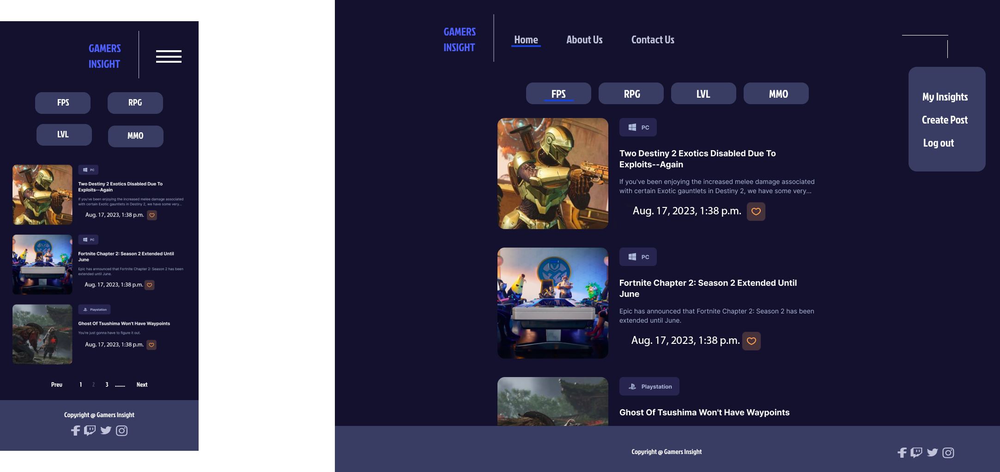
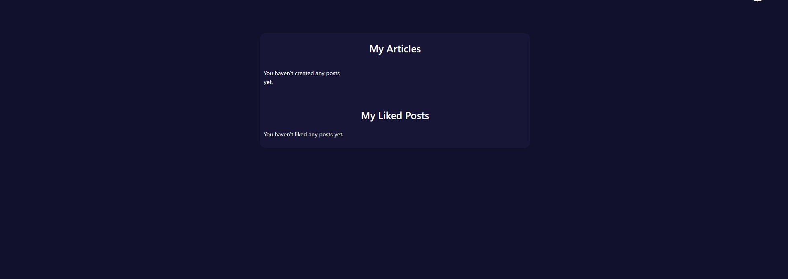

# Gamers Insight

Gamers Insight is a dynamic web application tailored for gaming enthusiasts, providing a platform to share and explore in-depth reviews of various video games. With Gamers Insight, users can create detailed blog posts to analyze game mechanics, graphics, storylines, and overall experiences. The application offers a seamless interface for readers to discover and engage with diverse gaming perspectives, while also fostering a community that appreciates thoughtful game critiques. Whether you're a passionate gamer or simply curious about the latest releases, Gamers Insight offers a space to immerse yourself in comprehensive game reviews and discussions.

<center> 

 

</center>


Developer: [Kim Bergström](https://github.com/KimBergstroem) <br>
[Live webpage](https://game-insight-1cff11f2b2d5.herokuapp.com/)<br>
[Project Repository](https://github.com/KimBergstroem/PP4)<br>


## Table of Content

- 📄[Project Goals](#project-goals)
  + [User Goals](#user-goals)
  + [Site Owner Goals](#site-owner-goals)
- 📄[User Experience](#user-experience)
  + [Target Audience](#target-audience)
  + [User Requirements and Expectations](#user-requirements-and-expectations)
  + [User Stories](#user-stories)
    - [Epic 1: User Experience (Visitor)](#epic-1--user-experience--visitor-)
    - [Epic 2: User Engagement and Interaction (Registered User)](#epic-2--user-engagement-and-interaction--registered-user-)
    - [Epic 3: Administration and Content Management (Admin/Content Moderator)](#epic-3--administration-and-content-management--admin-content-moderator-)
- 📄[Database](#database)
  + [Blog Application Database Schema](#blog-application-database-schema)
    - [GameCategory Table](#gamecategory-table)
    - [UserProfile Table](#userprofile-table)
    - [User Table](#user-table)
    - [Post Table](#post-table)
    - [Comment Table](#comment-table)
- 📄[Design](#design)
  + [Design Choices](#design-choices)
  + [Color](#color)
  + [Fonts](#fonts)
  + [Structure](#structure)
    - [Before Logging In:](#before-logging-in-)
    - [After Logging In:](#after-logging-in-)
    - [Profile Navigation:](#profile-navigation-)
  + [Wireframes](#wireframes)
- 📄[Technologies Used](#technologies-used)
  + [Languages](#languages)
  + [Frameworks](#frameworks)
  + [Database](#database-1)
  + [Tools](#tools)
  + [Supporting Libraries and Packages](#supporting-libraries-and-packages)
- 📄[Methodology](#methodology)
  + [Agile Project Management with GitHub Projects](#agile-project-management-with-github-projects)
  + [User Stories as GitHub Issues](#user-stories-as-github-issues)
  + [Bug Tracking for Seamless Development](#bug-tracking-for-seamless-development)
  + [Iterative Development Approach](#iterative-development-approach)
  + [Future Backlog and Progress](#future-backlog-and-progress)
- 📄[Features](#features)
  + [Landing Page:](#landing-page-)
  + [Blog Pages:](#blog-pages-)
  + [Blog Detail Page:](#blog-detail-page-)
  + [User Account Management:](#user-account-management-)
  + [Navigation:](#navigation-)
  + [Future Features](#future-features)
- 📄[Testing](#testing)
- 📄[Bugs](#bugs)
  + [Known bugs](#known-bugs)
  + [Fixed bugs](#fixed-bugs)
- 📄[Deployment](#deployment)
  + [App Deployment](#app-deployment)
  + [Cloudinary](#cloudinary)
  + [Version Control](#version-control)
  + [Forking the Repository:](#forking-the-repository-)
  + [Clone of the Repository:](#clone-of-the-repository-)
- 📄[Credits](#credits)
  + [Media](#media)
  + [Django Documentation:](#django-documentation-)
  + [W3 Schools:](#w3-schools-)
  + [Bootstrap docs:](#bootstrap-docs-)
  + [Geeksforgeeks:](#geeksforgeeks-)
  + [Various tutorials and YouTube channels:](#various-tutorials-and-youtube-channels-)
  + [Content](#content)
- 📄[Acknowledgments](#acknowledgments)

<small><i><a href='http://ecotrust-canada.github.io/markdown-toc/'>Table of contents generated with markdown-toc and modified by myself</a></i></small>

<p align="center">
  
</p>

# Project Goals 

Gamers Insight is a Django web application aimed at creating a vibrant platform for gamers to share their insights, opinions, uncovering cheat codes and experiences about various games. 
The key objectives of the project include:

- **Empowering Gamers:** Providing a dedicated space for gamers to contribute their reviews, articles, and discussions about different games.
- **User-Centric Experience:** Offering users an engaging and intuitive interface that encourages exploration and interaction.
- **Content Organization:** Enabling users to categorize and manage their articles, reviews, and discussions effectively.
- **User Profiles:** This allow users to create personalized profiles, showcase their gaming preferences, and keep track of their contributions.
- **Interactive Engagement:** Facilitating user interactions through comments, reviews, and discussions to foster a sense of community.
- **Administrator Control:** Equipping administrators with the tools to manage user accounts, moderate content, and ensure a safe environment.
- **Analytics and Insights:** Implementing analytics to understand user engagement, popular content, and areas for improvement.

### User Goals
- Exploring and sharing detailed game reviews and articles.
- Personalizing their profiles to showcase their gaming interests.
- Engaging in discussions and leaving comments to contribute to the gaming community.
- Saving favorite articles and reviews for easy access.
- Submitting their own game reviews, articles, and insights.
- Receiving notifications about new content and discussions.

### Site Owner Goals
- Providing a platform for gamers to express their thoughts and insights.
- Curating a diverse range of gaming-related content to cater to different preferences.
- Fostering a thriving gaming community where users can connect and share experiences.
- Ensuring user-generated content is moderated for quality and appropriateness.
- Enhancing user engagement and interaction through intuitive design and features.

Project "Gamers Insight" aims to create an awesome community for gamers to connect, share, and explore the world of gaming through insightful articles, discussions, and reviews.

<p align="right">(<a href="#table-of-content">back to top</a>)</p>
<p align="center">
  
</p>

# User Experience

### Target Audience
Gamers Insight is designed for the following target audience:

- Gaming enthusiasts and gamers looking for insights and reviews about various games.
- Individuals interested in exploring diverse gaming experiences and genres.
- Users who want to share their own game reviews, opinions, and experiences.
- Players seek a platform to engage in discussions about their favorite games.
- Individuals who wish to stay updated with the latest gaming trends and discussions.

### User Requirements and Expectations
When using Gamers Insight, users can expect the following features and characteristics to fulfill their needs:

- A user-friendly interface that provides intuitive navigation and easy access to gaming content.
- High-quality game reviews and articles that offer detailed insights and opinions.
- Responsive design ensures a visually appealing experience across different devices.
- Personalized features, such as user profiles showcase gaming preferences and track contributions.
- Interactive engagement through comments and discussions, fosters a sense of community.
- Notifications for new content and discussions to keep users informed and engaged.

Gamers Insight strives to create an immersive and interactive environment for users to share, discover, and discuss their passion for gaming.

### User Stories

#### Epic 1: User Experience (Visitor)

- [Easily Navigate and Find Content (should-have)](https://github.com/KimBergstroem/PP4/issues/1) #1 SPRINT 2
- [Visually Appealing Homepage (should-have)](https://github.com/KimBergstroem/PP4/issues/2) #2 SPRINT 2
- [Search for Specific Games or Topics (could-have)](https://github.com/KimBergstroem/PP4/issues/3) #3 SPRINT 2
- [Create a Personalized Profile (should-have)](https://github.com/KimBergstroem/PP4/issues/5) #5 SPRINT 3

#### Epic 2: User Engagement and Interaction (Registered User)

- [Read Detailed Game Reviews (should-have)](https://github.com/KimBergstroem/PP4/issues/4) #4 SPRINT 3
- [Save Favorite Articles and Create Reading Lists (should-have)](https://github.com/KimBergstroem/PP4/issues/6) #6 SPRINT 3
- [Receive Notifications (could-have)](https://github.com/KimBergstroem/PP4/issues/7) #7 SPRINT 4
- [Leave Comments and Engage in Discussions (must-have)](https://github.com/KimBergstroem/PP4/issues/8) #8 SPRINT 4
- [Submit Own Articles and Reviews (must-have)](https://github.com/KimBergstroem/PP4/issues/9) #9 SPRINT 4
- [Edit or Delete Own Articles and Comments (must-have)](https://github.com/KimBergstroem/PP4/issues/10) #10 SPRINT 4
- [Earn Badges or Rewards (won't-have)](https://github.com/KimBergstroem/PP4/issues/11) #11 SPRINT 4
- [Create Personalized Gaming Profile (should-have)](https://github.com/KimBergstroem/PP4/issues/16) #16 SPRINT 4
- [Save Favorite Articles and Create Reading List (could-have)](https://github.com/KimBergstroem/PP4/issues/17) #17 SPRINT 3

#### Epic 3: Administration and Content Management (Admin/Content Moderator)

- [Full Control Over User Accounts (must-have)](https://github.com/KimBergstroem/PP4/issues/12) #12 SPRINT 4
- [Review and Edit User-Submitted Articles (must-have)](https://github.com/KimBergstroem/PP4/issues/13) #13 SPRINT 4
- [Manage and Categorize Articles (could-have)](https://github.com/KimBergstroem/PP4/issues/14) #14 SPRINT 4
- [Track User Engagement and Analytics (could-have)](https://github.com/KimBergstroem/PP4/issues/15) #15 SPRINT 4

<br>

The user stories and epics are organized into four distinct sprints (milestones) to establish a well-defined work structure. You can access the details of these sprints by clicking [here](https://github.com/KimBergstroem/PP4/milestones), which will redirect you to the sprint information.

 

<p align="right">(<a href="#table-of-content">back to top</a>)</p>
<p align="center">
  
</p>

# Database
When creating the database structure schema for this project, I utilized the [dbdiagram.io](https://dbdiagram.io/) website. This online tool allowed me to visually design and document the database schema, making it easier to plan and implement the database for the blog application.

<center> 

 

</center>

### Blog Application Database Schema

#### GameCategory Table
- Stores game categories used for categorizing posts.
- Fields: gamecategory_id (primary key), name (category name), device (category device).

#### UserProfile Table
- Extends the User model to store additional user-specific information.
- Fields: userprofile_id (primary key), user (one-to-one relationship with the User model), first_name, last_name, profile_picture (user profile picture), bio (user bio), country (user's country).

#### User Table
- Represents user information. ( Django built In )
- Fields: user_id (primary key), username (user's name), email (user's email address), password (user's password).

#### Post Table
- Represents blog posts created by users.
- Fields: post_id (primary key), title (post title), slug (post slug), author_id (foreign key to User), update_on (post update date), content (post content), featured_image (featured image URL), excerpt (post excerpt), Created_on (post creation date), status (post status), likes (many-to-many relationship with User for post likes), category_id (many-to-many relationship with GameCategory for post categorization).

#### Comment Table
- Represents comments on blog posts.
- Fields: comment_id (primary key), post_id (foreign key to Post), name (commenter's name), email (commenter's email address), body (comment content), created_on (comment creation date), approved (comment approval status), user_id (foreign key to user model).

<br>
This database schema defines the structure and relationships for a blog application, including users, posts, comments, user profiles, game categories, and follower relationships.
<p align="right">(<a href="#table-of-content">back to top</a>)</p>
<p align="center">
  
</p>

# Design
In the realm of the Gamers Insight Blog, the design philosophy is centered around crafting a sleek and contemporary user interface that spotlights gaming insights. Inspiration springs from the immersive realms of video games, aiming to deliver a visually captivating experience to users. Primary goal is to facilitate easy navigation, discovery, and engagement within a vast collection of gaming articles.

### Design Choices
Our design choices were carefully crafted with gamers in mind. Created an environment that captures the essence of the gaming community.

### Color
Decision to adopt the 60-30-10 rule in our UI design is driven by its ability to create a cohesive and engaging user experience. This approach guarantees consistency by allocating 60% of our color palette to the dominant color, fostering brand recognition and trust. The 30% dedicated to the secondary color enables us to strike a visual balance, allowing for variations in content, headers, and backgrounds without overwhelming users. The remaining 10% allocated to the accent color serves to highlight interactive elements and calls to action, though we recommend choosing a contrasting shade for improved visibility and user engagement. This strategy ensures that our web application not only looks appealing but also functions effectively, guiding users to key elements while maintaining a harmonious and dependable design.


**Dominant (60%):** 

Choice of a deep blue shade, represented by #13112E as the dominant color, reflects our commitment to creating a unique and immersive gaming experience. This rich hue serves as the foundation for our web application's design, providing a dark and mysterious backdrop that resonates with the gaming community. It symbolizes trust and stability, inviting users to explore a world where they can delve into gaming insights.

**Secondary (30%):** 

The secondary color, also #13112E, is an intentional choice to maintain visual harmony and hierarchy throughout our design. It complements the dominant color with subtle variations, reinforcing the immersive atmosphere. This choice ensures that our users can navigate seamlessly through our content, discovering gaming insights with ease.

**Accent (10%):** 

While it might seem unconventional, our selection of #13112E as the accent color carries a unique significance. Chosen to keep a consistent blue theme throughout our UI, aligning with the essence of the gaming world. The accent color's role is to draw attention to interactive elements, such as buttons and links, creating a sense of cohesion and enhancing usability within our gaming community.

In short, our choice of colors isn't just about how things look; it's about creating a cool and welcoming place for gamers. A dark background is used as the main color (60%) to make the gaming experience more exciting. The blue colors picked, on making a design that gamers will really like.


### Fonts
The Gamers Insight Blog embraces the default fonts offered by Bootstrap 5, without any specific alterations, as they significantly enhance the overall aesthetics and user experience.

### Structure

User-friendly structure, ensuring seamless navigation and easy access to the website's content. Here's an overview of the website's structure:

#### Before Logging In:

- **Landing Page:** The landing page serves as the entry point to the Gamers Insight Blog, offering an introduction to our platform and a glimpse of the exciting content and features waiting for you.<br>
- **About Us:** The About Us page provides a deeper understanding of the Gamers Insight Blog. Discover our mission, values, and the many benefits of joining our vibrant gaming community.<br>
- **Sign Up:** If you're new to our platform, the Join Us page is where you can quickly create an account. Simply provide the necessary information to become a valued member of the Gamers Insight Blog.<br>
- **Log In:** Registered users can securely access their accounts and unlock the full potential of our website through the Log In page.<br>


#### After Logging In:
Once you've logged into the Gamers Insight Blog, you'll find yourself in the heart of our gaming world, with the following pages:

- **Home Page (Gamer's Hub):** This is where the gaming blog posts are revealed! The home page of our Gamer's Hub is like a treasure chest, filled with gaming articles.<br>
- **Profile Page:** This is your gaming identity hub. Gaming bio, achievements, and avatar. Customize your profile settings to make it truly yours.
- **Contact Us:** If you encounter any issues or have questions, our friendly admins are just a message away. Feel free to reach out via the "Contact Us" page, and we'll assist you with any concerns or inquiries you may have.<br>

Designed this space to be your gaming sanctuary, where you can share, discover, and discuss gaming insights with fellow gamers.

#### Profile Navigation:

Clicking on your profile image in the navigation bar opens up access to specific profile-related features:

- **My Insights:** The "My Insights" page is your own personal space like a profile. Here, you can view and manage the insights you've contributed to the Gamers Insight Blog.<br>
- **Create Post:** Ready to share your own gaming wisdom? The "Create Post" page is where you can craft your own insights and contribute to our gaming community. Share your knowledge and experiences with fellow gamers! Share the secrets of different games that you have knowledge about!<br>
- **Log Out:** When your gaming session is done, the "Log Out" option is here to help. Click here to safely log out and return to the real world after an epic gaming reading.<br>


### Wireframes
The wireframes serve as a visual blueprint for our web application, outlining the structure and functionality of each page. They provide a detailed representation of the user interface and overall user experience. These wireframes were meticulously crafted using Figma, a design tool renowned for its ability to facilitate rapid and intuitive prototyping. Click on each page to view the wireframe.

<details><summary>Landing page</summary>

</details>
<details><summary>About us</summary>

</details>
<details><summary>Sign Up</summary>

</details>
<details><summary>Log In</summary>

</details>
<details><summary>Home page (Blog articles)</summary>

</details>
<details><summary>Contact us</summary>

</details>
<details><summary>My Insights (Profile)</summary>

</details>
<details><summary>Create Post</summary>

</details>
<details><summary>Blog Post View</summary>

</details>
<details><summary>Log Out</summary>

</details>

<p align="right">(<a href="#table-of-content">back to top</a>)</p>
<p align="center">
  
</p>

# Technologies Used

### Languages
- HTML
- CSS
- Python

### Frameworks
- Django: A high-level Python web framework used for building the Gamers Insight Blog web application.
- Crispy Forms: A Django package used for rendering forms in a more efficient and customizable way.
- Bootstrap v5.0: A popular CSS framework used for creating responsive and visually appealing user interfaces.
- Cloudinary: A cloud-based media management platform used for storing and serving images in the Blog Collective project.

### Database
- ElephantSQL: ElephantSQL is a PostgreSQL database as a service. It is used as the database for the Blog Collective project, providing a reliable and scalable storage solution for the application's data.

### Tools
- **Git**: A distributed version control system used for tracking changes in the project's source code.
- **GitHub**: A web-based hosting service for version control repositories, used for storing and managing the project's source code.
- **Gitpod**: An online integrated development environment (IDE) used for developing and testing the Gamers Insight project.
- **Heroku**: A cloud platform that enables deployment and hosting of web applications. Heroku was used for deploying the Gamers Insight project to a live server.
- **Adobe Photoshop**: A professional image editing software used for advanced image manipulation.
- **Figma**: An online collaborative design tool that offers a wide range of design and prototyping capabilities. Figma was used for creating mockups, prototypes, and design assets for the Gamers Insight website.
- **DB diagram**: An online database design and diagramming tool that simplifies the process of creating and visualizing database schemas. dbdiagram.io was used for designing and documenting the database schema of the Gamers Insight project.
- **Google Fonts**: A collection of free and open-source fonts used for typography on Gamers Insight's website.
- **Font Awesome**: A library of icons used for adding scalable vector icons to Gamers Insight's website.
- **Mailtrap**: In this project, Mailtrap was integrated to power the contact form, providing a secure environment for users to reach out to Gamers Insights via email.


### Supporting Libraries and Packages
- asgiref==3.7.2
- cloudinary==1.34.0
- coverage==7.3.1
- Deprecated==1.2.14
- dj-database-url==0.5.0
- dj3-cloudinary-storage==0.0.6
- Django==3.2.21
- django-allauth==0.56.1
- django-braces==1.15.0
- django-crispy-forms==1.14.0
- django-oauth-toolkit==2.3.0
- django-summernote==0.8.20.0
- djangorestframework==3.14.0
- gunicorn==21.2.0
- iniconfig==2.0.0
- jwcrypto==1.5.0
- oauthlib==3.2.2
- Pillow==10.0.1
- pluggy==1.3.0
- psycopg2==2.9.7
- PyJWT==2.8.0
- pytest==7.4.2
- pytest-cov==4.1.0
- pytest-django==4.5.2
- python3-openid==3.2.0
- pytz==2023.3.post1
- requests-oauthlib==1.3.1
- social-auth-app-django==5.3.0
- social-auth-core==4.4.2
- sqlparse==0.4.4
- urllib3==1.26.16

<p align="right">(<a href="#table-of-content">back to top</a>)</p>
<p align="center">
  
</p>

# Methodology

The Gamers Insight project follows a methodology inspired by agile principles, fostering collaboration, flexibility, and gradual development. The outlined approach has guided the project's evolution:

### Agile Project Management with GitHub Projects
To streamline project management, GitHub Projects is employed as a central hub. User stories and tasks are structured as GitHub issues, creating an organized workflow. The GitHub project board serves as a visual representation, tracking progress effectively.

### User Stories as GitHub Issues
Transforming user stories into GitHub issues captures user-centric functionalities. These issues interlink with respective user stories, simplifying access to criteria, tasks, and discussions.

### Bug Tracking for Seamless Development
Bugs uncovered during development are documented as GitHub issues, offering insights into each bug's characteristics, impact, and reproduction steps. By hyperlinking these issues in README.md, users can stay updated on bug resolutions and contribute insights.

### Iterative Development Approach
The Gamers Insight project adheres to an iterative development approach, facilitating continuous enhancements within a predefined timeline. Despite its condensed schedule, the project accommodates future iterations and expansions.

### Future Backlog and Progress
The project board efficiently manages user stories, with the "Not started" column representing upcoming iterations. This backlog previews user stories set for subsequent development phases.

Emphasizing that the project timeline is expedited, the iterative approach maintains adaptability, enabling ongoing refinements and improvements aligned with evolving user needs.

**Labels and User Story Distribution (MoSCoW):**

- **Must-Have:** 6/19
- **Should-Have:** 6/19
- **Could-Have:** 5/19
- **Wont-Have:** 1/19
- **Task:** 2/19

For a comprehensive view of the project's trajectory, user stories, and bug tracking, explore the [Kanban board](https://github.com/users/KimBergstroem/projects/9).
<p align="right">(<a href="#table-of-content">back to top</a>)</p>
<p align="center">
  
</p>

# Features
### Landing Page:
- On the landing page, a prominent blue call-to-action button invites users to register and join our exclusive VIP blogging community. Additionally, a captivating hero image featuring a magic book is strategically positioned to immediately capture the user's attention and evoke the essence of the blogging experience.<details><summary>See Screenshot **Landingpage**</summary></details>

- Visitors can easily navigate to different sections available for unauthorized users of the website through the navigation bar. Visitors can also access our social media through the footer section.<details><summary>See Screenshot **Navbar**</summary></details><details><summary>See Screenshot **Footer**</summary></details>

### Blog Pages:
- When the user has logged in they will be directed to the Blog main page where they can scroll through blog article cards. <details><summary>See Screenshot **Main**</summary></details>

### Blog Detail Page:
- The blog details page displays comprehensive information about each article, including details about the writer and the article's creation date.<details><summary>See Screenshot **Post detail**</summary></details>

- Authors of posts have the privilege to edit or delete their content, ensuring they have control over their contributions.<details><summary>See Screenshot **Editing**</summary></details><details><summary>See Screenshot **Delete**</summary></details>

- Users can express their appreciation for a well-written blog post by liking it, which not only supports the author but also recognizes the quality of the content.<details><summary>See Screenshot **Like**</summary></details>

- Users can actively participate in the community by leaving comments on recipes. This provides a platform for sharing thoughts, suggestions, and feedback, fostering a vibrant and engaging community. Users also have the option to delete comments.<details><summary>See Screenshot **Comment**</summary></details>

### User Account Management:
- The account sign-up form allows new users to create an account and join the Gamers Insight community. The form has validation to make sure that the user enters the correct information needed. This is a Django built-in validation system. Such validation is:

    - **Username**: Required and has a maximum of 150 characters or fewer. Only letters, digits, and @/./+/-/_ are allowed.
    - **Email**: Required and must be in a valid email format.
    - **Password**: Subject to the following constraints:
        - Cannot be too similar to your other personal information.
        - Must contain at least 8 characters.
        - Cannot be a commonly used password.
        - Cannot be entirely numeric.
    - See Screenshot<details><summary>**SIGNUP VALIDATION**</summary></details>

- The login form ensures secure access to Gamers Insight by verifying your username and password. If you face login issues, use the 'Forgot Password?' link to reset your password. The form also displays validation error messages to guide you through any input errors.
    - See Screenshot<details><summary>**LOGIN VALIDATION**</summary></details>


- When an account is successfully created, the user will receive a confirmation message and gain access to the profile menu.<details><summary>See Screenshot **Success**</summary></details>

- Users can create posts.<details><summary>See Screenshot **Create Post**</summary></details>

- Users can access their profile page, where they can edit, delete, or change their password.<details><summary>See Screenshot **My Profile**</summary></details><details><summary>See Screenshot **Update Profile**</summary></details><details><summary>See Screenshot **Change Password**</summary></details><details><summary>See Screenshot **Delete Account**</summary></details>

- Users can view all their articles on a single page. This page will also display all user's Liked articles. If there is no post created or liked, that will be displayed.<details><summary>See Screenshot **My Articles**</summary></details><details><summary>See Screenshot **None Articles/Likes**</summary></details>

- Users can also use the "Logout" option to sign out of their accounts. Upon doing so, they will be directed to a confirmation page where they can confirm the logout.<details><summary>See Screenshot **Logout**</summary></details>


### Navigation:
- The navigation bar provides convenient access to various sections and pages of Gamers Insight, dynamically adjusting its options based on the user's authorization status. Authorized users also have the ability to submit queries to Gamers Insight using the Contact Us form. Users will have a confirmation message when successfully submit the form.<details><summary>See Screenshot **Contact Us**</summary></details><details><summary>See Screenshot **Contact Us Submitted**</summary></details>

- Both unauthorized and authorized users have access to the About Us page. However, depending on whether you are logged in or not, the call-to-action button displayed varies between "Log In" and "Create Post."<details><summary>See Screenshot **About Us Authorized**</summary></details><details><summary>See Screenshot **About Us Unauthorized**</summary></details>

- On smaller screens, the navigation bar collapses into a burger menu, allowing for a compact and mobile-friendly navigation experience. Users can access the menu by clicking on the burger icon, which reveals the navigation options in a dropdown fashion.


### Future Features
Here are some exciting features that I would like to add to the Gamers Insight in the future:

- **Favorite List and Save for Later:**  
  Enable users to mark blog articles as favorites for later reading.

- **User Profiles for Enhanced Interaction:**  
  Create user profiles that are accessible to everyone, enabling users to engage with one another, like, comment, and share their interests, fostering a sense of community and connection.

- **Seamless Social Media Sharing:**  
  Enable users to effortlessly share their favorite blog articles on various social media platforms, expanding the reach and visibility of Gamers Insight.

- **Multilingual Support:**  
  Implement multi-language support to make Gamers Insight accessible to users from diverse regions and cultural backgrounds, facilitating a more inclusive user experience.

- **Email Confirmation for Account Creation:**  
  Introduce email confirmation during the account creation process to enhance security and verify user identities effectively.

- **Password Reset Functionality:**  
  Implement a password reset function to provide users with a seamless and secure way to recover their account access.

<br>
These future enhancements aim to enrich Gamers Insight's user experience, foster community engagement, and expand its reach to a global audience.


<p align="right">(<a href="#table-of-content">back to top</a>)</p>
<p align="center">
  
</p>

# Testing

The Gamers Insight website went through a comprehensive testing process to guarantee its functionality, accessibility, and performance. This included checking the code, such as code validation, accessibility assessment, performance testing, cross-device testing, verification of browser compatibility, assessment of user stories, and the integration of user feedback to enhance the overall user experience.

All testing, including both manual and automated testing, was carried out and documented in [Testing.md](TESTING.md). 

<p align="right">(<a href="#table-of-content">back to top</a>)</p>
<p align="center">
  
</p>

# Bugs
The bug section descriptions have been linked with the bug issues in my documentation for better visibility, added color coding, and divided the content into sections, all aimed at enhancing readability. The links are clickable for more reading and solution.

### Known bugs

| **Bug** | **Description** |
| ------- | --------------- |
| [If the server restarts and a user has previously logged in, the landing page is still shown initially, when the user visits the site again.](https://github.com/KimBergstroem/PP4/issues/26) | This issue persists. |
| [Unable to send emails for the 'Password reset' function due to Gitpod blocking ports and in Heroku deployment. The steps work, but the email is not received. This could be due to an error in finding and installing OAuth templates and copying them into the template folder correctly. The path 'password_reset.html' is not found for OAuth templates, even though it is in my account/templates. This issue remains unresolved.](https://github.com/KimBergstroem/PP4/issues/27) | This issue is still unresolved. |
| [Encountered a Server Error (500) when trying to access the LOGIN or SIGNUP page in the deployed version on Heroku.](https://github.com/KimBergstroem/PP4/issues/28) | This issue is ongoing. Removed my "development" variable setup and if statement and just went with DEBUG = False. |
| [When a comment is deleted, users are redirected back to the post However, if they choose to go back by browser or mouse click(mouse4) from the post page, they encounter a 404 error page. This behavior has been documented as a bug in the system.](https://github.com/KimBergstroem/PP4/issues/29) | This issue persists, but handled by my customized 404 page. |
| [When attempting to upload video or GIF images as profile pictures/blog posts in the application hosted on Heroku, users may encounter an "app error" or "server error" during the upload process.](https://github.com/KimBergstroem/PP4/issues/30) | This issue persists. The issue persists, and it is suspected that it may be related to file format requirements or size restrictions. |


### Fixed bugs

| **Bug** | **Fix** |
| ------- | ------- |
| [Couldn't run Django.allauth, and couldn't get it to work.](https://github.com/KimBergstroem/PP4/issues/20) | Added "'allauth.account.middleware.AccountMiddleware'," under the MIDDLEWARE in SETTING.PY, as this is a new requirement from allauth. |
| [Couldn't run "cp -r ../.pip-modules/lib/python3.8/site-packages/allauth/templates/* ./templates", error message saying "No such file or directory"](https://github.com/KimBergstroem/PP4/issues/21) | Resolved by using the shell, typing "python" -> "import site" -> "print(site.getsitepackages())" -> Copying the path and then redoing the command in the shell for installing the templates of auth. |
| [Couldn't style my crispy form as desired and couldn't add Bootstrap classes.](https://github.com/KimBergstroem/PP4/issues/22) | Added every input separately inside a div and used "as_crispy_field". For example, added margin space to every input box and form-row. |
| [My stylesheet is not loading or cannot be found on Heroku. The error message is "its MIME type ('text/html') is not a supported stylesheet MIME type, and strict MIME checking is enabled."](https://github.com/KimBergstroem/PP4/issues/23) | Resolved by setting DEBUG to False if development is not found with an if statement. |
| [Clicking submit on the create post button twice quickly results in a URL 404 error response, indicating that the post is already created.](https://github.com/KimBergstroem/PP4/issues/24) | Created error handling pages for 403, 404, 405, and 500. |
| [Couldn't create a post with the same title as an already existing post. The error message received was:](https://github.com/KimBergstroem/PP4/issues/25) `IntegrityError at /post_create/duplicate key value violates unique constraint "blog_post_slug_key" DETAIL:  Key (slug)=(test) already exists.` | To maintain the uniqueness of slugs for posts, an if statement was added to the code, along with the use of timezone.now(). This ensures that if two posts have the same title, a timestamp is appended to one of them to create a unique slug. |


<p align="right">(<a href="#table-of-content">back to top</a>)</p>
<p align="center">
  
</p>

# Deployment

### App Deployment
For deploying Your app, Heroku is used. Follow these steps:

 **Create a New App:**
   - Create a new app on Heroku dashboard.

 **Configure Settings:**
   - Navigate to "Settings" in new app.

 **Config Vars Setup:**
   - In "Config Vars," add `PORT` as the key and `8000` as its value.

 **Add PostgreSQL Database:**
   - Choose PostgreSQL as database.

        Example "ElephantSQL" was used in this project

 **Configure DATABASE_URL:**
   - In "Config Vars," add `DATABASE_URL` and copy the URL from PostgreSQL dashboard.

     Note: If using ElephantSQL as PostgreSQL provider, you can use the URL provided by ElephantSQL.

 **Environment Variable Setup:**
   - Create a new file in workspace called `env.py`.
   - Import the `os` library and set the environment variable for `DATABASE_URL` to the Heroku address (or ElephantSQL URL)
   - Add a secret key using `os.environ["SECRET_KEY"] = "your secret key here"`.

 **Heroku Config Vars:**
   - Add the secret key to the Heroku app's config vars in the settings.

 **Django Settings:**
   - In `settings.py` of Django app, import `Path` from `pathlib`, `os`, and `dj_database_url`.
   - Add `if os.path.isfile("env.py"): import env` to the file.
   - Replace the SECRET_KEY with `SECRET_KEY = os.environ.get('SECRET_KEY')`.
   - Replace the database section with `DATABASES = {'default': dj_database_url.parse(os.environ.get("DATABASE_URL"))}`.

 **Migrate Models:**
   - In workspace terminal, migrate the models to the new database connection.

### Cloudinary
To integrate Cloudinary into project, follow these steps:

 **Cloudinary Account:**
   - Log in to Cloudinary account or create one.

 **Copy CLOUDINARY_URL:**
   - Copy `CLOUDINARY_URL`.

 **Environment Variable Setup:**
   - In `env.py`, add `os.environ["CLOUDINARY_URL"] = "add cloudinary_url here"`.

 **Heroku Config Vars:**
   - In Heroku settings, add `CLOUDINARY_URL` to config vars.

 **Django Settings:**
   - In `INSTALLED_APPS`, add `cloudinary_storage`, `Django.contrib.staticfiles`, and `cloudinary` in this order.
   - Configure static file settings in `settings.py`: URL, storage path, directory path, root path, media URL, and default file storage.

 **Templates Directory Link:**
   - Link the file to the templates directory in Heroku with `TEMPLATES_DIR = os.path.join(BASE_DIR, 'templates')`.

 **Change Templates Directory:**
   - Change the templates directory to `TEMPLATES_DIR - 'DIRS': [TEMPLATES_DIR]`.

 **Additional Folders:**
   - Create three new folders: `media`, `static`, and `templates`.

 **Procfile Creation:**
   - Create a `Procfile`.
   - Add the following line inside the Procfile: `web: gunicorn project_name_here.wsgi`.

 **Push Changes:**
    - Push all changes to GitHub.

 **Manual Deployment:**
    - In the Heroku deployment tab, deploy to Heroku manually the first time and closely monitor the process.
    - Once successful, set up automatic deployments.

### Version Control
To manage version control and push code to the main repository on GitHub using GitPod, follow these steps:

 **Add Changes:**
   - In the GitPod terminal, use the command `git add .` to stage changes.

 **Commit Changes:**
   - Commit changes with a descriptive comment using the command:
     ```
     git commit -m "Push comment here"
     ```

 **Push to GitHub:**
   - Push the updates to the repository on GitHub with the command:
     ```
     git push
     ```


 **Migrate Models:**
    - In the terminal, migrate the models to the new database connection.

### Forking the Repository:

By forking the GitHub Repository, can create a copy of the original repository without affecting the original. Follow these steps:

 **GitHub Account Setup:**
   - Log into GitHub account or create one if you don't have one.

 **Locate the Repository:**
   - Find the repository at [https://github.com/KimBergstroem/PP4](https://github.com/KimBergstroem/PP4).

 **Fork the Repository:**
   - At the top right of the repository page, click "Fork" to create a copy in your own GitHub repository.

### Clone of the Repository:

Creating a clone allows you to have a local copy of the project. Follow these steps:

 **Repository URL:**
   - Navigate to [https://github.com/KimBergstroem/PP4](https://github.com/KimBergstroem/PP4).
   - Click the green "Code" button at the top right.

 **Clone the Repository:**
   - Select the "Clone by HTTPS" option and copy the provided URL to the clipboard.

 **Terminal and Git:**
   - Open your code editor or terminal and navigate to the directory where you want to clone the repository.
   - Run `git clone` followed by the copied URL.
   - Press enter, and Git will clone the repository to your local machine.


To fork the repository, follow these steps:

1. Go to the GitHub repository.
2. Click on the Fork button in the upper right-hand corner.
3. Wait for the forking process to complete. Once done, you will have a copy of the repository in your GitHub account.

To clone the repository, follow these steps:

1. Go to the GitHub repository.
2. Locate the Code button above the list of files and click it.
3. Select your preferred method for cloning: HTTPS, SSH, or GitHub CLI, and click the copy button to copy the repository URL to your clipboard.
4. Open Git Bash (or your preferred terminal).
5. Change the current working directory to the location where you want the cloned directory to be created.
6. Type the command `git clone` followed by the URL you copied in step 3. The command should look like this: `git clone https://github.com/YOUR-USERNAME/YOUR-REPOSITORY`.
7. Press Enter to create your local clone.
<p align="right">(<a href="#table-of-content">back to top</a>)</p>
<p align="center">
  
</p>

# Credits
I would like to express my gratitude to the following resources, which have been a huge help to me in the development of the Gamer Insight - Blog.

### Media
Images are taken from the following page:
- [Leonardo.ai](https://leonardo.ai/) **Used as a landing page hero image**


### Django Documentation:
The official Django documentation has been an invaluable resource throughout the project, providing comprehensive guidance on models, forms, templates, and various aspects of Django development.

- [Models](https://docs.djangoproject.com/en/4.2/topics/db/models/)
- [Form Validation](https://docs.djangoproject.com/en/4.1/ref/forms/validation/)
- [Model Field Types](https://docs.djangoproject.com/en/4.2/ref/models/fields/#model-field-types)
- [CSRF Trusted Origins](https://docs.djangoproject.com/en/4.0/ref/settings/#csrf-trusted-origins)
- [Built-in template tags and filters](https://docs.djangoproject.com/en/4.2/ref/templates/builtins/)
- [Creating forms from models](https://docs.djangoproject.com/en/4.2/topics/forms/modelforms/)
- [Model instance reference](https://docs.djangoproject.com/en/4.2/ref/models/instances/)
- [Signals](https://docs.djangoproject.com/en/4.2/topics/signals/)
- [Using mixins with class-based views](https://docs.djangoproject.com/en/4.2/topics/class-based-views/mixins/#detailview-working-with-a-single-django-object)
- [Using widgets in the form](https://docs.djangoproject.com/en/4.2/ref/forms/widgets/)
- [Date string form](https://docs.djangoproject.com/en/3.2/ref/templates/builtins/#date)


### W3 Schools:
- [Overrite Bootstraps css variables](https://www.w3schools.com/css/css_important.asp)

### Bootstrap docs:
- [Increase knowledge of bootstrap framework](https://getbootstrap.com/docs/5.3/getting-started/introduction/)

### Geeksforgeeks: 
- [Using crisp form](https://www.geeksforgeeks.org/styling-django-forms-with-django-crispy-forms/)

### Various tutorials and YouTube channels:
I would like to extend my appreciation to the authors of the tutorials and YouTube channels that have shared their knowledge and expertise in Django development, enabling me to learn and apply best practices in building Gamers Insight.
- [Python Django Tutorial: Full-Featured Web App Part 1 - Getting Started](https://www.youtube.com/watch?v=UmljXZIypDchttps://www.youtube.com/watch?v=UmljXZIypDc)
- [Python and Django - Django Blog ](https://www.youtube.com/watch?v=B40bteAMM_M&list=PLCC34OHNcOtr025c1kHSPrnP18YPB-NFi)
- [Django Tutorial - Setup](https://www.youtube.com/watch?v=Z4D3M-NSN58&list=PLzMcBGfZo4-kQkZp-j9PNyKq7Yw5VYjq9)
- [Style The Login Page With Bootstrap](https://www.youtube.com/watch?v=0Z_3APyKwQ4)
- [User Profile Update Display View with Image](https://www.youtube.com/watch?v=7DU-uhhYI6Y&list=PLSPMgrv4IuJ5wS0xSQzKUB038MYIx9ufI&index=12)
- [Style The Post details view](https://www.bootdey.com/snippets/tagged/blog)
- [Automated Testing: Behaviour Driven Development with Naoise Gaffney](https://www.youtube.com/watch?v=tHSJ4-ZqbLs)
- [Django Testing Tutorial - How To Test Your Django Applications](https://www.youtube.com/playlist?list=PLbpAWbHbi5rMF2j5n6imm0enrSD9eQUaM)

### Content

- Paragraphs/text for the webpage/readme was written together with [ChatGPT](https://chat.openai.com/)

- Tips and inspiration on how to create a better readme.md file [kera-cudmore PowerPoint](https://docs.google.com/presentation/d/19_7r_To5bu7UjnZD87hrzWQi63Ij0YpaRH1XFnPZZe8/edit#slide=id.g35f391192_00)

- English spellchecker as Google Chrome extension [Grammarly](https://www.grammarly.com/)


<p align="right">(<a href="#table-of-content">back to top</a>)</p>
<p align="center">
  
</p>

# Acknowledgments
I'd like to give recognition to the individuals who supported me in completing this project:

* My family, for their patience and assistance in identifying spelling mistakes and testing issues. Their support has been invaluable in improving the quality of this project.
* Testers [Debbie B](https://github.com/DebbieBergstrom) and [Sandra B](https://github.com/SandraBergstrom) for their significant contributions in providing feedback, identifying errors, and offering valuable insights.
* [Brian](https://github.com/), my Code Institute Mentor, for his exceptional guidance and expertise, which greatly contributed to my growth as a developer.
* [Alan Bushell](https://github.com/Alan-Bushell), our cohort facilitator, for his dedication and weekly meetings where he has provided guidance, support, and encouragement to our cohort.

[Code Institute Slack Channel:](https://codeinstitute.net/) I received feedback from numerous users in a channel with over 3,000 members where I shared my Gamers Insight project's readme. I am genuinely appreciative of the valuable feedback I received from the community.

I am truly grateful for their contributions, which have greatly enriched my learning and development.


<p align="right">(<a href="#table-of-content">back to top</a>)</p>
<p align="center">
  
</p>