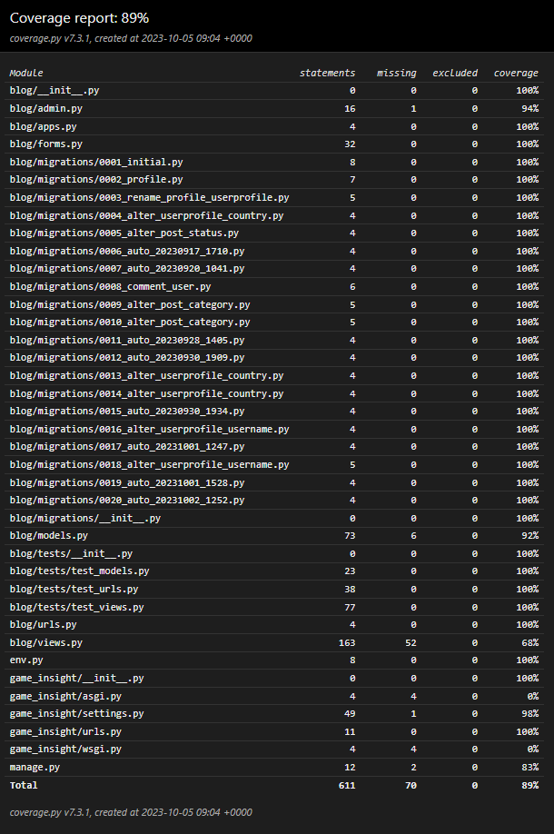

# Gamers Insight Testing 

Developer: [Kim Bergström](https://github.com/KimBergstroem)  
[Live webpage](https://game-insight-1cff11f2b2d5.herokuapp.com/) 
[Project Repository](https://github.com/KimBergstroem/PP4) 

## Table of Content

* 📄[Code Validation](#code-validation)
  + [HTML Validation](#html-validation)
  + [CSS Validation](#css-validation)
  + [Python Validaton](#--pep8-validator--)
* 📄[Accessibility](#accessibility)
  + [Wave](#--wave--)
* 📄[Performance](#performance)
  + [Desktop Performance](#desktop-performance)
  + [Mobile Performance](#mobile-performance)
* 📄[Performing tests on various devices](#performing-tests-on-various-devices)
* 📄[Browser compatibility](#browser-compatibility)
* 📄[Automated Testing](#automated-testing)
  + [test_views.py](#test-viewspy)
  + [test_models.py](#test-modelspy)
  + [test_urls.py](#test-urlspy)
* 📄[Manual Testing](#manual-testing)
  + [Testing user stories](#testing-user-stories)
  + [User Experience and Improvements](#user-experience-and-improvements)
  + [Full Testing](#full-testing)
* 📄[Summary](#summary)

<small><i><a href='http://ecotrust-canada.github.io/markdown-toc/'>Table of contents generated with markdown-toc and modified by myself</a></i></small>

  

## Code Validation

### HTML Validation

W3C Markup Validation is a service offered by W3C, which enables you to assess the compliance of your HTML code with the official standards. This service identifies syntax errors, improper tag usage, and other issues that might impact the structure and meaning of your web pages. By utilizing W3C Markup Validation, you can ensure that your HTML code is well-structured and conforms to established web standards.

Google Chrome web browser and the 'Inspect' function were used to capture the HTML page from the webb applications templates, which was then validated against the W3C Validator.

In this project, a rich text editor called "Summernote" is used to allow users to create and update posts with HTML content. While Summernote enhances the user experience, it introduces some complexities when validating our HTML code.

When users create or update posts, they have the flexibility to input HTML, which can sometimes lead to unconventional HTML structures or attributes. These unconventional structures are detected as errors when I validate our HTML code using external tools like the W3C validator.

Due to the interaction between Summernote and the need to ensure the security of application. To protect against security threats and potential attacks, implemented safeguards such as using the `|safe` filter in our forms. This filter prevents user-entered HTML from compromising the security of application.

| **Tested** | **Result** | **View Result** | **Pass** |
--- | --- | --- | :---:
|landing_page.html| No errors | 

Screenshot of result

| ✅
|about.html| No errors | 

Screenshot of result

| ✅
|login.html| No errors | 

Screenshot of result

| ✅
|signup.html| No errors | 

Screenshot of result

| ✅
|index.html| No errors | 

Screenshot of result

| ✅
|post_detail.html| "The font element is obsolete. Use CSS instead." | 

Screenshot of result

| ✅
|contactus.html| No errors | 

Screenshot of result

| ✅
|contactus_success.html| No errors | 

Screenshot of result

| ✅
|profile.html| No errors | 

Screenshot of result

| ✅
|my_articles.html| No errors | 

Screenshot of result

| ✅
|post_create.html| Bad value true for attribute hidden on element textarea., Attribute cols are not allowed on element div at this point.,  Bad value 100% for attribute width on element iframe: Expected a digit but saw % instead., The frame border attribute on the iframe element is obsolete. Use CSS instead.  | 

Screenshot of result

| ✅
|logout.html| No errors | 

Screenshot of result

| ✅
|post_delete.html| No errors | 

Screenshot of result

| ✅
|post_update.html| Bad value true for attribute hidden on element textarea., Attribute cols are not allowed on element div at this point.,  Bad value 100% for attribute width on element iframe: Expected a digit but saw % instead., The frame border attribute on the iframe element is obsolete. Use CSS instead. | 

Screenshot of result

| ✅
|profile_delete.html| No errors | 

Screenshot of result

| ✅
|profile_update.html| No errors | 

Screenshot of result

| ✅
|password_change.html| No errors | 

Screenshot of result

| ✅

### CSS Validation
[W3C Jigsaw](https://jigsaw.w3.org/css-validator/) is a tool provided by the World Wide Web Consortium (W3C) that allows you to validate and check the correctness of your HTML and CSS code. It helps ensure that your web pages comply with the standards set by the W3C, promoting interoperability and accessibility.

| **Tested** | **Result** | **View Result** | **Pass** |
--- | --- | --- | :---:
|CSS file | No errors |

Screenshot of result

| ✅
|Whole webpage | No errors  |[Result](https://jigsaw.w3.org/css-validator/validator?uri=https%3A%2F%2Fgame-insight-1cff11f2b2d5.herokuapp.com%2F&profile=css3svg&usermedium=all&warning=1&vextwarning=&lang=sv#warnings)| ✅

### Python Validaton 
[PEP 8](https://pep8ci.herokuapp.com/) serves as a comprehensive style guide for writing Python code, emphasizing consistency and readability as its core principles. It offers guidance on code formatting, variable and function naming conventions, and various best practices. Adhering to PEP 8 principles contributes to enhancing code quality, making it more readable and maintainable.

Within the settings file, one URL was identified as being excessively long. The other lines that exceeded the recommended length were automatically generated by Django. All other files were free from errors and issues.

| **Tested** | **Result** | **View Result** | **Pass** |
--- | --- | --- | :---:
|game_insight/settings.py | All clear, no errors found | | ✅
|game_insight/urls.py | All clear, no errors found || ✅
|blog/models.py | All clear, no errors found || ✅
|blog/views.py | All clear, no errors found || ✅
|blog/forms.py | All clear, no errors found | | ✅
|blog/urls.py | All clear, no errors found || ✅
|blog/admin.py | All clear, no errors found || ✅
|blog/tests/test_views.py | All clear, no errors found || ✅
|blog/tests/test_models.py | All clear, no errors found || ✅
|blog/tests/test_urls.py | All clear, no errors found || ✅

(<a href="#table-of-content">back to top</a>)

  

## Accessibility

### **Wave**

[The WAVE Web Accessibility Evaluation Tool](https://wave.webaim.org/) was used to assess the accessibility of the website. WAVE helps identify potential accessibility issues and provides guidance on how to improve the accessibility of web content.

During the evaluation, the following issues were identified:

- **Errors**: The website generated 4 errors, which were related to the footer `<a>` (anchor) tags. There was no `aria-label` or text describing them. This was, of course, added to fix the errors.

- **Contrast Warning**: Received a contrast warning for the primary button, which was blue used by Bootstrap's class "btn-primary". This color was not good against my dark purple background. The Solution was to increase the primary button's blue color to a lighter shade.

  

By using the WAVE tool, I gained valuable insights into the accessibility of my website. While I have chosen not to address certain errors at this time, I remain committed to creating an inclusive user experience and will continue to explore ways to improve accessibility in the future.

(<a href="#table-of-content">back to top</a>)

  

## Performance
I conducted a comprehensive evaluation of [The Gamers Insight website](https://game-insight-1cff11f2b2d5.herokuapp.com/) using [Google Lighthouse in Google Chrome Developer Tools](https://developer.chrome.com/docs/lighthouse/). This evaluation was performed in Google Chrome browser's incognito mode to eliminate all potential impacts from other addons and cached files.

Known Errors Impacting `index.html` and `post_detail.html` Pages the most, but even edit/delete post pages. Using Cloudinary as an image and storage server for users to upload their images. The following errors were identified during Lighthouse validation, and they currently cannot be changed. These errors have had an impact on the overall performance of these pages:

- Serving images in next-gen formats
- Properly sizing images
- Efficiently encoding images
- Eliminating render-blocking resources

The performance scores were assessed for both desktop and mobile devices. Below are the summarized results:

### Desktop Performance
- Average performance score: 98/100
- The majority of pages received scores above 90/100, indicating excellent performance.

| **Tested** | **Performance Score** | **View Result** | **Pass** |
--- | --- | --- | :---:
|landing_page.html| 93 / 100 | 

Screenshot of result

 | ✅
|about.html| 92 / 100 | 

Screenshot of result

 | ✅
|login.html| 100 / 100 | 

Screenshot of result

 | ✅
|signup.html | 100 / 100 | 

Screenshot of result

 | ✅
|index.html| 93 / 100 | 

Screenshot of result

 | ✅
|post_detail.html| 92 / 100 | 

Screenshot of result

 | ✅
|contactus.html| 92 / 100 | 

Screenshot of result

 | ✅
|contactus_success.html| 100 / 100 | 

Screenshot of result

| ✅
|profile.html| 100 / 100 | 

Screenshot of result

 | ✅
|my_articles.html| 99 / 100| 

Screenshot of result

 | ✅
|post_create.html| 99 / 100 | 

Screenshot of result

 | ✅
|logout.html| 100 / 100 | 

Screenshot of result

 | ✅
|post_delete.html| 100 / 100 | 

Screenshot of result

 | ✅
|post_update.html| 100 / 100 | 

Screenshot of result

 | ✅
|profile_delete.html| 100 / 100 | 

Screenshot of result

 | ✅
|profile_update.html| 100 / 100 | 

Screenshot of result

 | ✅
|password_change.html| 100 / 100 | 

Screenshot of result

 | ✅

### Mobile Performance
- Average performance score: 92/100
- The pages showed slightly lower performance compared to the desktop but still maintained a satisfactory score.

| **Tested** | **Performance** | **View Result** | **Pass** |
--- | --- | --- | :---:
|landing_page.html| 92 / 100 | 

Screenshot of result

 | ✅
|about.html| 94 / 100 | 

Screenshot of result

 | ✅
|login.html| 96 / 100 | 

Screenshot of result

 | ✅
|signup.html | 96 / 100 | 

Screenshot of result

 | ✅
|index.html| 80 / 100 | 

Screenshot of result

 | ✅
|post_detail.html| 83 / 100 | 

Screenshot of result

 | ✅
|contactus.html| 96 / 100 | 

Screenshot of result

 | ✅
|contactus_success.html| 96 / 100 | 

Screenshot of result

| ✅
|profile.html| 96 / 100 | 

Screenshot of result

 | ✅
|my_articles.html| 86 / 100| 

Screenshot of result

 | ✅
|post_create.html| 86 / 100 | 

Screenshot of result

 | ✅
|logout.html| 96 / 100 | 

Screenshot of result

 | ✅
|post_delete.html| 95 / 100 | 

Screenshot of result

 | ✅
|post_update.html| 93 / 100 | 

Screenshot of result

 | ✅
|profile_delete.html| 96 / 100 | 

Screenshot of result

 | ✅
|profile_update.html| 95 / 100 | 

Screenshot of result

 | ✅
|password_change.html| 95 / 100 | 

Screenshot of result

 | ✅

In terms of performance, the Gamers Insight website delivered strong results, ensuring a seamless user experience on both desktop and mobile platforms.

(<a href="#table-of-content">back to top</a>)

  

## Performing tests on various devices
The website was tested on the following devices:

<ins>Mobile</ins>
1. Samsung s22 ultra 
2. iPhone X 
3. Samsung galaxy s22
4. iPhone 14 Pro max

<ins>Desktop</ins>
1. Samsung Galaxy Book 360
2. HP Elite book 830 g9
3. HP Victus gaming desktop

<ins>Monitors</ins>
1. 49-inch Samsung CHG9 ultra-wide
2. 27-inch Benq zowie XL2746S
3. 27-inch Dell ultrasharp U2723QE

In addition, the website was tested using the Google Chrome Developer Tools Device Toggling option for all available device options.

(<a href="#table-of-content">back to top</a>)

  

## Browser compatibility
The website was tested on the following:

<ins>Browsers</ins>
1. Microsoft Edge
2. Google Chrome 	
3. Mozilla Firefox 	
4. Safari

(<a href="#table-of-content">back to top</a>)

  

## Automated Testing

Automated testing was a critical phase conducted towards the end of the project to gain a deeper understanding of automated testing practices and to uncover any hidden bugs or errors that might have slipped through. This phase focused on testing the essential components and functionalities of the project, with a particular emphasis on the CRUD (Create, Read, Update, Delete) operations and various URL patterns and view paths.

If more time was existing in this project, I would also create tests for all user stories.

I created a folder called "tests" inside of my blog application.
In this folder I created three separate files, each corresponding to a specific aspect of the project that needed testing. 
For conducting the tests, I leveraged Django's built-in testing framework and used the `django.test.TestCase` class as the foundation. This framework provides a robust and standardized environment for writing and executing tests, making it easier to assess the project's functionality and reliability.

Before the testing process, it was needed to configure the project's settings in the "settings.py" file in order for the automated testing to work properly. I added this two condition, 1 variable and 1 import statement. This was removed from settings.py when uploading the project to production in heroku for keeping the production settings separate from testing settings.

- `import sys`
- `TEST_APPS = ['blog.tests']` 
- `if 'test' in sys.argv or 'test_coverage' in sys.argv:
    DATABASES = {
        'default': {
            'ENGINE': 'django.db.backends.sqlite3',
            'NAME': BASE_DIR / 'db.sqlite3',
        }
    }
else:
    DATABASES = {
        'default': dj_database_url.parse(
            os.environ.get('DATABASE_URL')
        )
    }`

&nbsp;

### test_views.py

### test_models.py

### test_urls.py

My initial tests passed without errors, the testing process did reveal some bugs and errors. You can find details about these issues, documented in my readme file, click [here](README.md)

To measure code coverage and assess how much of the project's codebase is tested, I used the Coverage.py tool. Here are the steps to view the coverage report in HTML format:

Installing the Coverage.py using pip
- `Pip install coverage`

To check coverage in the HTML format run in the terminal:

- `coverage run --source='.' manage.py test`
  - This will create a `.coverage` file in your root directory
- `coverage html`
  - This will create a folder in your root directory called `htmlcov`
  - Right-click on it and select "Open with Live Server" to view the detailed coverage report.

My tests have achieved 89% code coverage, but there's always room for improvement and further testing that can help improve this score.

  

(<a href="#table-of-content">back to top</a>)

  

## Manual Testing

### Testing user stories

&nbsp;

**First Time Visitors**

| First Time User Goals | How this was achieved | Screenshot |
| --- | --- | --- |
| [Easily Navigate and Find Content](https://github.com/KimBergstroem/PP4/issues/1) | Implemented a big navbar with navigation links that clearly state their purpose. Included two prominent login and sign-up buttons. | 

Screenshot of result

 |
| [Visually Appealing Homepage](https://github.com/KimBergstroem/PP4/issues/2) | Created a landing page featuring a small animation of a magic book image and an engaging call-to-action header. | 

Screenshot of result

 |
| [Search for Specific Games or Topics](https://github.com/KimBergstroem/PP4/issues/3) | Displayed category buttons on the homepage, enabling users to easily navigate content by category. | 

Screenshot of result

 |
| [Create a Personalized Profile](https://github.com/KimBergstroem/PP4/issues/5) | Automatically redirect first-time users to their profile page upon login, where they have the option to update their profile to their liking. | 

Screenshot of result

 |

**Returning Visitors**

| Returning User Goals | How this was achieved | Screenshot |
| --- | --- | --- |
| [Read Detailed Game Reviews](https://github.com/KimBergstroem/PP4/issues/4) | Users can access detailed game reviews by clicking on the "Articles" menu. They can click on the info button or the article itself to view more details about the game blog post. | 

Screenshot of result

 |
| [Save Favorite Articles and Create Reading Lists](https://github.com/KimBergstroem/PP4/issues/6) | Although not fully implemented, users have a "My Articles" menu in their profile where they can view posts they've liked and created. In the future, this section will also include favorites. | 

Screenshot of result

 |
| [Receive Notifications](https://github.com/KimBergstroem/PP4/issues/7) | While not fully implemented yet, there are plans to introduce a notification system, similar to a newsletter, in the near future. | 

Screenshot of result

 |
| [Leave Comments and Engage in Discussions](https://github.com/KimBergstroem/PP4/issues/8) | Users can engage in discussions by leaving comments on other blog articles. There are no limits on submissions, and users can interact with one another. | 

Screenshot of result

 |
| [Submit Own Articles and Reviews](https://github.com/KimBergstroem/PP4/issues/9) | Users can create their own blog posts by accessing the "Create Post" menu on their profile. | 

Screenshot of result

 |
| [Edit or Delete Own Articles and Comments](https://github.com/KimBergstroem/PP4/issues/10) | On individual blog posts, users have the option to edit or delete the post. This option is available only to the user who created the post. | 

Screenshot of result

 |
| [Earn Badges or Rewards](https://github.com/KimBergstroem/PP4/issues/11) | Currently, the only reward system in place is related to liked posts. This information can also be viewed in the "My Articles" section of a user's profile. | 

Screenshot of result

 |
| [Create Personalized Gaming Profile](https://github.com/KimBergstroem/PP4/issues/16) | Users can customize their gaming profile by visiting their profile page and updating their information. | 

Screenshot of result

 |
| [Save Favorite Articles and Create Reading Lists](https://github.com/KimBergstroem/PP4/issues/17) | Users can like other posts or create posts, and all this information will be saved in the "My Articles" section, making it easily accessible. | 

Screenshot of result

 |

**Site Owner**

| Site Owner Goals | How this was achieved | Screenshot |
| --- | --- | --- |
| [Full Control Over User Accounts](https://github.com/KimBergstroem/PP4/issues/12) | Site owners or admin users have access to an admin dashboard where they can have complete control over user accounts, including management and oversight. | 

Screenshot of result

 |
| [Review and Edit User-Submitted Articles](https://github.com/KimBergstroem/PP4/issues/13) | Admins or site owners can effectively review and edit user-submitted articles through the admin dashboard, which provides a convenient list view for article management. | 

Screenshot of result

 |
| [Manage and Categorize Articles](https://github.com/KimBergstroem/PP4/issues/14) | Site owners or admins can manage article categories by adding, deleting, and overseeing them in the admin dashboard. Any changes made here will be reflected in the web application's category structure. | 

Screenshot of result

 |
| [Track User Engagement and Analytics](https://github.com/KimBergstroem/PP4/issues/15) | Admins or site owners can monitor user engagement and analytics through the dashboard, providing insights into articles, comments, and overall user activity on the platform. | 

Screenshot of result

 |

&nbsp;

### User Experience and Improvements
I engaged in user testing involving individuals from the Slack group called "#peer-code-review" from Code Institute to collect feedback regarding their website experience. I requested them to complete the following tasks and share their feedback on their overall experience:

I also asked family members and friends. 

Total users attended the testing: 8

| Test                   | Result  |
|------------------------|---------|
| Create an account      | **100%**|
| Update the profile     | **100%**|
| Add a blog post        | **100%**|
| Edit a post            | **100%**|
| Like a post            | **100%**|
| Unlike a post          | **100%**|
| Comment on a post      | **100%**|
| Delete comment         | **100%**|
| Delete a post          | **100%**|
| Test links             | **100%**|
| Delete account         | **100%**|

&nbsp;

**Feedback from testers**

Provided feedback and reported any issues or improvements they encountered during the testing process. Below is the feedback/issues reported.

| **Feature**          | **Feedback**                                                                                                                                                                                                                                      | **Solution**                                                                                                                                                                              | **Result**                            | **Fixed** |
|----------------------|----------------------------------------------------------------------------------------------------------------------------------------------------------------------------------------------------------------------------------------------------|------------------------------------------------------------------------------------------------------------------------------------------------------------------------------------------|---------------------------------------|:--------:|
| Navbar               | Social links are not opened in a new TAB                                                                                                                                                                                                           | Added 'target="_blank"' to the `a` tags.                                                                                                                                                  | Social links now open in a new tab. | ✅  |
| Max Length           | Max length should be reduced in different fields (Check all inputs forms models) Content Excerpt                                                                                                                                               | Added 'max_length=' both in `form.py` and `models.py` for client and server-side validation.                                                                                                                                                           | Max length reduced for various fields to improve validation. | ✅  |
| Post Details Icon    | Post details: Thumbs up is a heart instead, which may be confusing. Stick with the same icon.                                                                                                                                                          | Changed to a thumbs-up icon to match the blog post page.                                                                                                                                 | Post details now use a consistent thumbs-up icon.        | ✅  |
| Author Link          | In `index.html` (blog main page), the Author name is not clickable, and the like comment icons look like they should be clickable. Present them in a different way maybe?                                                                      | I removed the clickable link to the user's author profile for the post. I kept the icon display as it is for design purposes, which is a common way to display 'liked' posts and the number of comments. Additionally, I added a tooltip mouse hovercard that explains to users that they need to visit the post detail page if they want to like the post.                                                                                        | Author's name is no longer clickable; icons remain the same. | ✅  |
| Comment Max Length   | Post Details - Comment input has no max length, fix max length.                                                                                                                                                                                  | Added `max_length=300` in my Comment(model) for the comment field in post_details. Also added custom CSS media queries to present the comment on different screens so that no overflow breaks the comment field. | Comment input now has a max length, and it's presented properly on different screens.                     | ✅  |
| Profile picture | Users who update their profile picture should also see it displayed in the profile menu icon at the top right corner of the website. | Initially, attempted to display the user's profile picture instead of the current icon, but I found that it didn't look as good as the existing settings. Therefore, I decided to keep the profile icon as it is. | The profile icon remains unchanged for a better user experience. | ✅ |
| Delete / Edit | In the post_detail page, the "Edit" and "Delete" post and comment text are not displayed very well. I would prefer icons for better visualization. | Added more spacing between the words and also included icons for "Delete" and "Edit" for improved visualization. | "Edit" and "Delete" now have both text and icons. | ✅ |  
| Responsive           | Responsive needs to be fixed - Profile picture (nav menu collapse), Category buttons, Navbar in the smallest screens, it pops out of GAMERS INSIGHT and not in the same row. | Added custom styles with media queries to quickly fix responsiveness issues. Used small Bootstrap classes in some cases.                                                                                                                           | Responsive design improvements implemented.                | ✅  |

### Full Testing

**`Navbar unauthorized user`**

| Feature | Expected Outcome | Testing Performed | Result | Pass/Fail |
| --- | --- | --- | --- | --- |
| Logo | Redirects to landing_page.html page | Clicked on logo | Landing page loads | ✅ |
| Home | Redirects to the landing page | Clicked on the link "Home" | Landing page loads | ✅ |
| About | Redirects to the About page with the Join Now button | Clicked on the link "About" | About page loads and shows the Join Now button | ✅ |
| Login | Redirects to the login page | Clicked on the link "Login" | Login page loads and form displays | ✅ |
| Sign up | Redirects to the signup page and form | Clicked on the link "Sign up" | Sign-up page loads and the form displays | ✅ |

**`Navbar authorized user`**

| Feature | Expected Outcome | Testing Performed | Result | Pass/Fail |
| --- | --- | --- | --- | --- |
| Logo | Redirects to index.html(articles) page | Clicked on logo | Index page loads | ✅ |
| Articles | Redirect to the blog post page | Clicked on the link "Articles" | Index.html page loads with a view of blog posts | ✅ |
| About | Redirects to the About page with the Create Post button | Clicked on the link "About" | About page loads and shows the Create Post button | ✅ |
| Profile image/icon | Triggers the dropdown menu | Clicked on the image | The dropdown menu is displayed | ✅ |

**`Landing page`**

| Feature | Expected Outcome | Testing Performed | Result | Pass/Fail |
| --- | --- | --- | --- | --- |
| Join now button | Redirects to the sign up page and editable form | Clicked on "Join now" button | Sign-up page loads, displaying the editable form | ✅ |

**`Profile drop-down menu`**

| Feature | Expected Outcome | Testing Performed | Result | Pass/Fail |
| --- | --- | --- | --- | --- |
| Profile | Redirects to the profile page with the user's information and editable form | Clicked on the "Profile" link | Profile page loads, displaying the user's information and an editable form | ✅ |
| My Articles | Redirects to the page displaying the user's created posts and liked post history | Clicked on the "My Articles" link | "My Articles" page loads, showing the user's created blog posts and liked post list | ✅ |
| Create Post | Redirects to the page where the user can create a blog post with an editable form | Clicked on the "Create Post" link | "Create Post" page loads, displaying the Create Post form | ✅ |
| Logout | Redirects the user to a logout confirmation page | Clicked on "Logout" | User is redirected to a page confirming the logout | ✅ |

**`Index page`**

| Feature | Expected Outcome | Testing Performed | Result | Pass/Fail |
| --- | --- | --- | --- | --- |
| All Category button | Redirects to the page displaying all blog posts | Clicked on the "All Category" button | Successfully redirected to the page displaying all blog posts | ✅ |
| My "FPS" button | Redirects to the page displaying all blog posts with the category "FPS" | Clicked on the "FPS" button | Successfully redirected to the page displaying blog posts with FPS as the category | ✅ |
| My "MMO" button | Redirects to the page displaying all blog posts with the category "MMO" | Clicked on the "MMO" button | Successfully redirected to the page displaying blog posts with MMO as the category | ✅ |
| My "RPG" button | Redirects to the page displaying all blog posts with the category "RPG" | Clicked on the "RPG" button | Successfully redirected to the page displaying blog posts with RPG as the category | ✅ |
| Article card image link | Redirects to the blog post detail page | Clicked on the image link of an article card | Successfully redirected to the blog post detail page | ✅ |
| Article card title link | Redirects to the blog post detail page | Clicked on the title link of an article card | Successfully redirected to the blog post detail page | ✅ |
| Article card info button | Redirects to the blog post detail page | Clicked on the info button of an article card | Successfully redirected to the blog post detail page | ✅ |
| Pagination | Displays pagination if more than 9 blog posts | Added more than 9 blog posts to the list | Pagination is displayed showing the correct number of pages | ✅ |
| Page buttons on pagination | Navigates to the correct page | Clicked on page number/next/previous buttons in pagination | Successfully navigated to the correct page based on the button clicked | ✅ |

**`About page unauthorized user`**

| Feature | Expected Outcome | Testing Performed | Result | Pass/Fail |
| --- | --- | --- | --- | --- |
| Join now button | Redirects to the sign-up page and editable form | Clicked on "Join now" button | The sign-up page loads, displaying the editable form | ✅ |

**`About page authorized user`**

| Feature | Expected Outcome | Testing Performed | Result | Pass/Fail |
| --- | --- | --- | --- | --- |
| Create Post button | Redirects to the Create Post page and editable form | Clicked on the "Create Post" button | The Create Post page loads, displaying the editable form | ✅ |

**`Contact Us page authorized user`**

| Feature | Expected Outcome | Testing Performed | Result | Pass/Fail |
| --- | --- | --- | --- | --- |
| Name | Field is required and should be a valid name format | Tested with an empty field, invalid format | Error message is displayed prompting the user to provide a valid name | ✅ |
| Email | Field is required and should be a valid email format | Tested with an empty field, or invalid format | Error message displayed prompting the user to provide a valid email address | ✅ |
| Subject | Field is required and can't be left empty | Tested with an empty field, invalid criteria | Error message displayed prompting the user to provide a subject | ✅ |
| Submit | If the form is valid, the user is redirected to the Thank you for submission page with a confirmation. | Clicked the submit button with valid and non-valid formats | The submit button functions as expected, redirecting to the appropriate confirmation page and displaying the corresponding messages | ✅ |

**`Sign up page`**

| Feature | Expected Outcome | Testing Performed | Result | Pass/Fail |
| --- | --- | --- | --- | --- |
| Username | Field is required and should be a valid username format | Tested with an empty field, invalid format | Error message is displayed prompting the user to provide a valid username | ✅ |
| Email | Field is required and should be a valid email format | Tested with an empty field, or invalid format | Error message displayed prompting the user to provide a valid email address | ✅ |
| Password | Field is required and should meet password criteria | Tested with an empty field, invalid criteria | Error message displayed prompting the user to provide a valid password | ✅ |
| Password confirmation | Field is required and should match the entered password | Tested with empty field, mismatched passwords | Error message displayed prompting the user to confirm the password correctly | ✅ |
| Sign up button | If the form is valid, the user is redirected to the profile page with a flash message confirming successful registration. If the form is not valid, an error message is displayed. | Clicked the button with valid and non-valid formats | The button functions as expected, redirecting to the appropriate page and displaying the corresponding messages | ✅ |
| Login text link | Redirects to the login page | Clicked on the "Login" link | The login page and form were successfully loaded | ✅ |

**`Log in page`**

| Feature | Expected Outcome | Testing Performed | Result | Pass/Fail |
| --- | --- | --- | --- | --- |
| Username | The user enters a username | Tested with valid and invalid username input | The username field accepts and saves the valid input. If invalid, it displays an error message | ✅ |
| Password | The user enters a password | Tested with valid and invalid password input | The password field functions correctly, allowing the user to input a valid password and displays an error message when not valid | ✅ |
| Forgot password? text link | Clicking the text link redirects to the password change page for requesting the user's email | Clicked on the "Forgot Password?" text link | Successfully redirected to the password change page with the requested email input | ❌ |
| Sign up text link | Clicking the text link redirects to the sign-up page | Clicked on the "Sign up" text link | Successfully redirected to the sign-up page with the registration form | ✅ |
| Login | If the login form is valid, the user is logged in and redirected to the appropriate page. If the form is not valid, an error message is displayed. | Tested with valid and invalid login form input | The login button functions correctly, logging in the user with valid credentials and displaying error messages for invalid credentials | ✅ |

**`Profile page`**

| Feature | Expected Outcome | Testing Performed | Result | Pass/Fail |
| --- | --- | --- | --- | --- |
| Update | Redirect the user to the update profile page with an editable form | Clicked on the "Update" button | Redirected to the correct page with an editable "Update Profile" form | ✅ |
| Change password | Redirect to the change password page with an editable form for a new password | Clicked on the "Change password" button | Redirected to the change password page and able to change the password | ✅ |
| Delete | Redirect the user to the Delete confirmation page | Clicked on the "Delete" button | Redirected to the correct page with a confirmation message and a back button | ✅ |

**`Update profile page`**

| Feature | Expected Outcome | Testing Performed | Result | Pass/Fail |
| --- | --- | --- | --- | --- |
| Update | When changes are made and the "Update" button is clicked, the changes should be saved, the user should be redirected to the profile page, and a flash message should confirm the update | Made changes and click on the "Update" button | Changes were successfully saved, redirected to the profile page with the new information displayed, and a flash message confirmed the update | ✅ |
| Back | Redirects to the profile page without any changes | Clicked on the "Back" button | The profile page loads, displaying the profile information without any changes | ✅ |

**`Change password page`**

| Feature | Expected Outcome | Testing Performed | Result | Pass/Fail |
| --- | --- | --- | --- | --- |
| Password | Field is required and should meet password criteria | Tested with an empty field, invalid criteria, and a similar password as the current password | Error message displayed prompting the user to provide a valid password | ✅ |
| Forgot password? text link | Clicking the text link redirects to the password reset page for requesting the user's email | Clicked on the "Forgot Password?" text link | Successfully redirected to the password reset page with the requested email input. The reason on why this is set to Fail, is after the submit the email never received at requested email for be able to have the new password. Please see current [Bug#27](https://github.com/KimBergstroem/PP4/issues/27) | ❌ |
| Update | When changes are made and the "Update" button is clicked, the changes should be saved, the user should be redirected to the profile page, and a flash message should confirm the change of the new password | Made changes and click on the "Update" button | Changes were successfully saved, redirected to the profile page, and a flash message confirmed the update | ✅ |
| Back | Redirects to the profile page without any changes | Clicked on the "Back" button | The profile page loads, displaying the profile information without any changes | ✅ |

**`Delete profile page`**

| Feature | Expected Outcome | Testing Performed | Result | Pass/Fail |
| --- | --- | --- | --- | --- |
| Delete | When the "Delete" button is clicked, the user should be logged out and redirected to the landing_page.html with a successful confirmation message flashing | Clicked on the "Delete" button | Redirected to the landing page with no access to the account or user, and a flashing message confirming the deletion of the user account | ✅ |
| Cancel | Redirects to the profile page | Clicked on the "Back" button | The profile page loads, displaying the profile information | ✅ |

**`Post Detail page`**

| Feature | Expected Outcome | Testing Performed | Result | Pass/Fail |
| --- | --- | --- | --- | --- |
| Category text link | Redirect user to the page where all blog posts with the same category are visible | Clicked on the text category link | Successfully clicked the text category link and was redirected to the expected page | ✅ |
| Comment | The comment is displayed with the date, username, and user profile image | Added a comment | The comment is successfully displayed with the corresponding date, username, and image | ✅ |
| Delete comment button | Only shown on the user's own comment. Deleting the comment and redirect the user to the same blog post where the comment was made | Clicked on the delete button on the comment field | Only shown on the user's comment field and successfully deleted comment was redirecting to the same blog post page | ✅ |
| Edit button | Only shown on the user's own blog post. Takes the user to the created post form with pre-filled fields | Clicked on the Edit button | Only shown on the user's blog post and successfully redirected to the blog post form with the fields pre-filled | ✅ |
| Delete button | Only shown on the user's own blog post. Redirects to the delete confirmation page | Clicked on the delete button | Only shown on the user's blog post and successfully redirected to the delete confirmation page | ✅ |
| Thumbs up icon | Toggles between liked or Unliked with blue text color different for confirmation IF liked | Clicked on the thumbs up icon | Successfully clicked the thumbs up icon and have the icon and Liked text in blue color as confirmation | ✅ |

**`Update post page`**

| Feature | Expected Outcome | Testing Performed | Result | Pass/Fail |
| --- | --- | --- | --- | --- |
| Update | When changes are made and the "Update" button is clicked, the changes should be saved, the user should be redirected to the blog post detail page, and a flash message should confirm the update | Made changes and click on the "Update" button | Changes were successfully saved, redirected to the blog post detail page, and a flash message confirmed the update | ✅ |
| Back | Redirects to the blog post detail page | Clicked on the "Back" button | The blog post detail page loads, displaying the blog post | ✅ |

**`Delete post page`**

| Feature | Expected Outcome | Testing Performed | Result | Pass/Fail |
| --- | --- | --- | --- | --- |
| Delete button | Deletes the blog post and redirects to the index.html page where all the articles are displayed | Clicked on the delete button | The blog post was successfully deleted, and I was redirected to the index.html page | ✅ |
| Cancel button | Redirects to the blog post detail page | Clicked on the "Cancel" button | The blog post detail page loads, displaying the blog post | ✅ |

**`403, 404, 405, 500 Page`**

| Feature | Expected Outcome | Testing Performed | Result | Pass/Fail |
| --- | --- | --- | --- | --- |
| Go home button | Correct "error message" displays and redirects the user to index.html page where the articles are | Edited a non-URL path in the web browser and then clicked on the Go home button | Correct error handling message was displayed for the user, and when the Go home button was clicked, the user was redirected to the index page where articles are displayed | ✅ |

(<a href="#table-of-content">back to top</a>)

  

## Summary

Testing The Gamers Insight web application, conducted a comprehensive evaluation of various aspects, including HTML validation, CSS validation, accessibility, performance, and user experience. The following summarizes our key findings and the status of our testing:

### HTML Validation

- HTML validation tests were mostly successful, with only a few minor issues detected. These issues were related to unconventional HTML structures introduced by the Summernote rich text editor, but they have been handled appropriately.

### CSS Validation

- CSS code was free from errors, ensuring compliance with web standards and promoting consistent design and layout.

### Accessibility

- The WAVE Web Accessibility Evaluation Tool helped identify potential accessibility issues, including errors and contrast warnings. I addressed these issues promptly to improve the overall accessibility of the website.

### Performance

- Performance tests yielded strong results, indicating excellent performance on both desktop and mobile devices. Some known errors related to image optimization were identified but could not be resolved due to external dependencies.

### User Experience

- Engaged in user testing with various scenarios and received positive feedback from testers, addressing any issues they encountered.

### Automated Testing

- I conducted automated testing using Django's testing framework, covering essential components, CRUD functionalities, and URL patterns. Automated tests passed successfully, ensuring the reliability of critical features.

### User Stories

- Tested a wide range of user stories and scenarios, ensuring that users can easily navigate, interact with, and enjoy the website's features.

### Overall Status

This project Gamers Insight is in good shape, with most features functioning as expected. Have addressed identified issues and incorporated user feedback to enhance the user experience. Continuous monitoring and testing will help us maintain a stable and user-friendly platform.

Remain committed to delivering an exceptional gaming community experience and will continue to work on improving accessibility, performance, and user satisfaction.

(<a href="#table-of-content">back to top</a>)

  

